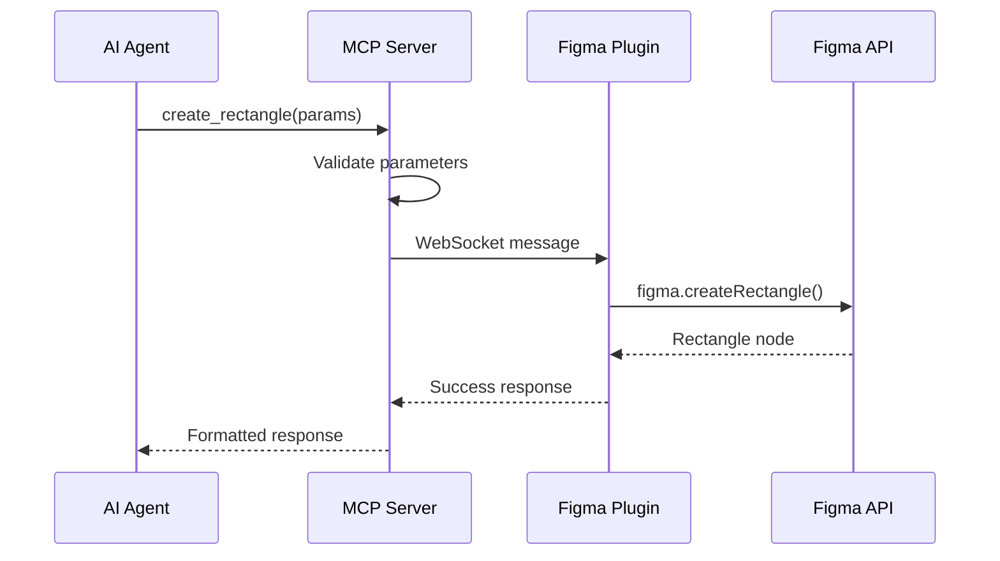

# Development Guide

## 🔧 Setting Up Development Environment

### Prerequisites
- Node.js 18+ with npm
- TypeScript knowledge
- Figma account and desktop app
- Understanding of MCP protocol

### Initial Setup
```bash
# Clone the repository
git clone <repository-url>
cd figma-mcp-write-server

# Install dependencies
npm install

# Build TypeScript
npm run build

# Start development server with watch mode
npm run dev
```

### Project Structure
```
figma-mcp-write-server/
├── src/                     # MCP Server source code
│   ├── types.ts            # Type definitions and Zod schemas
│   ├── mcp-server.ts       # MCP server with built-in WebSocket server
│   └── index.ts            # CLI entry point
├── figma-plugin/           # Figma plugin source code
│   ├── manifest.json       # Plugin configuration
│   ├── code.js             # Plugin WebSocket client
│   └── ui.html             # Plugin user interface
├── EXAMPLES.md             # Usage examples and guides
├── dist/                   # Compiled JavaScript output
├── package.json            # Node.js dependencies and scripts
├── tsconfig.json           # TypeScript configuration
└── README.md               # Project documentation
```

## 🏗️ Architecture Overview

The system uses a direct communication architecture between the MCP server and Figma plugin:

### MCP Tools (v0.13.0)
The server provides 15 MCP tools covering all major Figma operations:

**Core Creation & Modification:**
- `create_node` - Create shapes, text, frames
- `create_text` - Typography with style ranges
- `update_node`, `move_node`, `delete_node`, `duplicate_node`

**Style Management:**
- `manage_styles` - Paint, text, effect, and grid styles

**Auto Layout & Constraints (NEW v0.13.0):**
- `manage_auto_layout` - Responsive content arrangement
- `manage_constraints` - Element positioning and resizing

**Hierarchy & Organization:**
- `manage_hierarchy` - Grouping, layering, parent-child relationships

**Selection & Export:**
- `get_selection`, `set_selection`, `get_page_nodes`, `export_node`

**Status & Debugging:**
- `get_plugin_status`

### Components

#### 1. MCP Server (`src/`)
- **MCP Server** (`mcp-server.ts`) - Implements MCP protocol with built-in WebSocket server
- **Entry Point** (`index.ts`) - CLI interface and startup logic with help text
- **Type Definitions** (`types.ts`) - Shared types and Zod schemas

#### 2. Figma Plugin (`figma-plugin/`)
- **Plugin** (`code.js`) - WebSocket client that connects to MCP server on port 8765
- **UI** (`ui.html`) - Real-time status monitoring and connection feedback
- **Manifest** (`manifest.json`) - Plugin configuration and permissions

### Communication Flow


## 🔌 Communication Protocol

### Message Types

#### Request Messages
```typescript
interface PluginMessage {
  id: string;              // UUID for request tracking
  type: 'CREATE_RECTANGLE' | 'UPDATE_NODE' | ...;
  payload?: any;           // Operation-specific parameters
}
```

#### Response Messages
```typescript
interface PluginResponse {
  id: string;              // Matching request ID
  success: boolean;        // Operation status
  data?: any;              // Result data
  error?: string;          // Error message if failed
}
```

## 🛠️ Adding New Operations

### 1. Define Types
Add new schemas to `types.ts`:
```typescript
export const CreateComponentSchema = z.object({
  name: z.string(),
  width: z.number(),
  height: z.number(),
  // ... other properties
});
```

### 2. Update Message Types
Add to the PluginMessage type enum:
```typescript
type: z.enum([
  // ... existing types
  'CREATE_COMPONENT',
])
```

### 3. Implement MCP Tool
Add to `mcp-server.ts`:
```typescript
{
  name: 'create_component',
  description: 'Create a new component',
  inputSchema: CreateComponentSchema,
}
```

### 4. Add Tool Handler
```typescript
case 'create_component':
  return await this.createComponent(args);

private async createComponent(args: any) {
  const params = CreateComponentSchema.parse(args);
  const response = await this.pluginClient.sendToPlugin({
    id: uuidv4(),
    type: 'CREATE_COMPONENT',
    payload: params
  });
  // ... handle response
}
```

### 5. Implement Plugin Handler
Add to `code.js`:
```typescript
case 'CREATE_COMPONENT':
  await createComponent(id, payload);
  break;

async function createComponent(id, params) {
  const component = figma.createComponent();
  component.name = params.name;
  component.resize(params.width, params.height);
  // ... implementation
  sendResponse(id, true, { nodeId: component.id });
}
```

## 🧪 Testing Strategy

### Unit Tests
Test individual components in isolation:
```typescript
// Test schema validation
describe('CreateRectangleSchema', () => {
  it('should validate correct parameters', () => {
    const result = CreateRectangleSchema.parse({
      x: 0, y: 0, width: 100, height: 100
    });
    expect(result).toBeDefined();
  });
});
```

### Integration Tests
Test operation flows:
```typescript
// Test MCP tool execution
describe('create_rectangle tool', () => {
  it('should create rectangle in Figma', async () => {
    const server = new FigmaMCPServer();
    const result = await server.handleToolCall({
      name: 'create_rectangle',
      arguments: { x: 0, y: 0, width: 100, height: 100 }
    });
    expect(result.success).toBe(true);
  });
});
```

### Manual Testing
1. Start development server: `npm run dev`
2. Load plugin in Figma
3. Test each MCP tool through your MCP client
4. Verify results in Figma
5. Check error handling

## 🐛 Debugging

### MCP Server Debugging
```bash
# Enable debug logging
npm run dev

# Check WebSocket connections
netstat -an | grep 8765
```

### Plugin Debugging
1. Open Figma Plugin Console: **Plugins** → **Development** → **Open Console**
2. Check WebSocket connection status in plugin UI
3. Monitor message flow in console logs
4. Test individual operations

### Common Issues

#### Plugin Won't Connect
- Check WebSocket port availability (default: 8765)
- Verify MCP server is running
- Verify plugin is running in Figma
- Check network connectivity
- Look for connection errors in plugin console

#### Operations Fail
- Validate parameter schemas in `types.ts`
- Check Figma API permissions in manifest
- Verify node IDs exist before operations
- Ensure file is not in Dev Mode

#### Performance Problems
- Monitor message queue size
- Check heartbeat timing
- Optimize batch operations
- Reduce WebSocket message frequency

## 📊 Performance Optimization

### Message Batching
Group multiple operations:
```typescript
// Instead of multiple individual calls
await createRectangle(params1);
await createRectangle(params2);
await createRectangle(params3);

// Use batch operation (if implemented)
await batchCreate([params1, params2, params3]);
```

### Connection Management
Optimize WebSocket usage:
```typescript
class PluginClient {
  private connection: WebSocket;
  
  async ensureConnection() {
    if (!this.connection || this.connection.readyState !== WebSocket.OPEN) {
      await this.connect();
    }
  }
}
```

### Caching
Cache frequently accessed data:
```typescript
class NodeCache {
  private cache = new Map();
  
  async getNode(id: string) {
    if (this.cache.has(id)) {
      return this.cache.get(id);
    }
    // Fetch from Figma and cache
  }
}
```

## 🔒 Security Best Practices

### Input Validation
Always validate inputs with Zod schemas:
```typescript
const params = CreateRectangleSchema.parse(args);
```

### Connection Security
- Use localhost-only connections
- Implement connection timeouts
- Validate message origins

### Error Handling
Never expose internal errors to clients:
```typescript
catch (error) {
  console.error('Internal error:', error);
  return { error: 'Operation failed' };
}
```

## 📦 Available MCP Tools

The server provides 11 MCP tools for Figma operations:

| Category | Tools | Description |
|----------|-------|-------------|
| **Create** | `create_node`, `create_text` | Create design elements with typography support |
| **Styles** | `manage_styles` | Style management (paint, text, effect, grid) |
| **Modify** | `update_node`, `move_node`, `delete_node`, `duplicate_node` | Modify existing elements |
| **Selection** | `get_selection`, `set_selection` | Manage element selection |
| **Data** | `get_page_nodes`, `export_node` | Read design data |
| **Status** | `get_plugin_status` | Monitor connection health |

### Style Management Features
The `manage_styles` tool provides style management:
- **Paint Styles**: Solid colors, gradients (linear, radial, angular, diamond), image fills
- **Text Styles**: Typography control with Figma text properties
- **Effect Styles**: Drop shadows, inner shadows, layer blur, background blur
- **Grid Styles**: Column/row/grid layouts with full configuration
- **CRUD Operations**: Create, list, apply, delete, and get styles
- **Style Application**: Apply styles to any compatible node type

### Typography Features
The `create_text` tool provides typography capabilities:
- **Mixed Styling**: Apply different fonts, sizes, and colors to text segments with `styleRanges`
- **Text Styles**: Create reusable text styles with `createStyle` and `styleName`
- **Typography Properties**: Font families, weights, alignment, spacing, case, and decoration
- **Layout Control**: Fixed-width text with automatic height adjustment
- **Formatting**: Line height units, letter spacing, paragraph formatting

## 🚀 Deployment

### Production Build
```bash
npm run build
npm start
```

### Development Mode
```bash
npm run dev  # Watch mode with auto-restart
```

### Configuration
Set environment variables:
- `FIGMA_MCP_PORT` - WebSocket port (default: 8765)

## 📚 Additional Resources

### Figma Plugin API
- [Official Plugin API Docs](https://www.figma.com/plugin-docs/)
- [Plugin API Reference](https://www.figma.com/plugin-docs/api/api-reference/)
- [Plugin Development Guide](https://www.figma.com/plugin-docs/how-plugins-run/)

### Model Context Protocol
- [MCP Specification](https://modelcontextprotocol.io/)
- [MCP SDK Documentation](https://github.com/modelcontextprotocol/typescript-sdk)
- [MCP Examples](https://github.com/modelcontextprotocol/servers)

### WebSocket Communication
- [WebSocket API](https://developer.mozilla.org/en-US/docs/Web/API/WebSocket)
- [Node.js ws Library](https://github.com/websockets/ws)

## 🤝 Contributing

### Code Style
- Use TypeScript for type safety
- Follow existing code patterns
- Add Zod schemas for new data types
- Include error handling for all operations

### Pull Request Process
1. Fork the repository
2. Create a feature branch
3. Add tests for new functionality
4. Update documentation as needed
5. Submit pull request with clear description

### Reporting Issues
- Use GitHub issues for bug reports
- Include steps to reproduce
- Provide error logs and console output
- Specify Figma version and OS

---

This development guide covers the essential information for working with the Figma MCP Write Server. For usage examples and setup instructions, see the [README](README.md) and [EXAMPLES.md](EXAMPLES.md).
