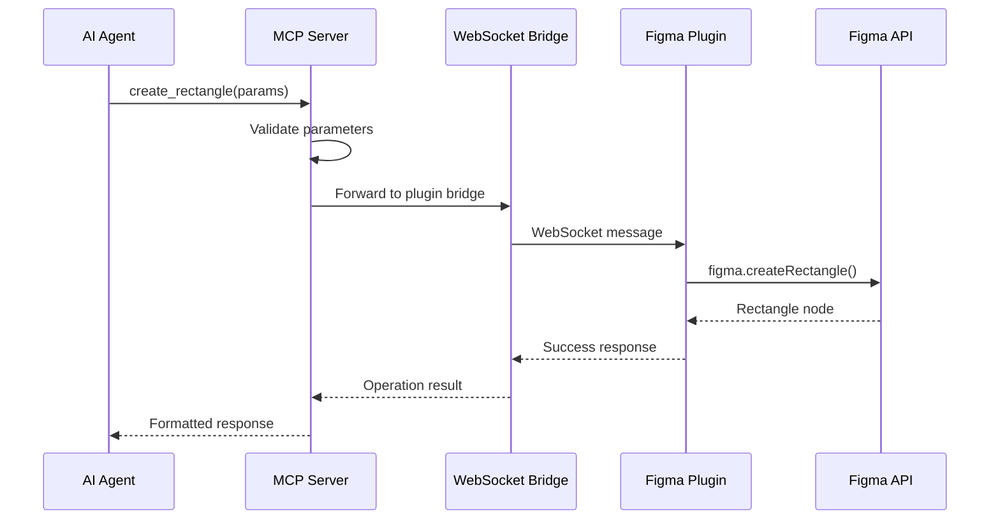

# Development Guide

## 🔧 Setting Up Development Environment

### Prerequisites
- Node.js 18+ with npm
- TypeScript knowledge
- Figma account and desktop app
- Understanding of MCP protocol

### Initial Setup
```bash
# Clone the repository
git clone <repository-url>
cd figma-mcp-write-server

# Install dependencies
npm install

# Build TypeScript
npm run build

# Start development server with watch mode
npm run dev
```

### Project Structure
```
figma-mcp-write-server/
├── src/                     # MCP Server source code
│   ├── types.ts            # Type definitions and schemas
│   ├── plugin-bridge.ts    # WebSocket bridge to Figma plugin
│   ├── mcp-server.ts       # Main MCP server implementation
│   └── index.ts            # CLI entry point
├── figma-plugin/           # Figma plugin source code
│   ├── manifest.json       # Plugin configuration
│   ├── code.js             # Plugin main thread code
│   └── ui.html             # Plugin user interface
├── dist/                   # Compiled JavaScript output
├── package.json            # Node.js dependencies and scripts
├── tsconfig.json           # TypeScript configuration
└── README.md               # Project documentation
```

## 🏗️ Architecture Deep Dive

### MCP Server Components

#### 1. Type System (`types.ts`)
- **Zod Schemas**: Runtime type validation for all operations
- **Plugin Messages**: Structured communication protocol
- **MCP Tool Schemas**: Input validation for each tool
- **Configuration Types**: Server and plugin settings

#### 2. Plugin Bridge (`plugin-bridge.ts`)
- **WebSocket Server**: Manages connections from Figma plugin
- **Message Queue**: Handles async request/response patterns
- **Heartbeat System**: Monitors connection health
- **Error Handling**: Robust failure recovery

#### 3. MCP Server (`mcp-server.ts`)
- **Tool Registration**: Defines available MCP tools
- **Request Handling**: Processes tool calls from MCP clients
- **Parameter Validation**: Ensures type safety
- **Response Formatting**: Standardized result format

### Figma Plugin Components

#### 1. Main Thread (`code.js`)
- **WebSocket Client**: Connects to MCP server
- **Message Handlers**: Processes operation requests
- **Figma API Calls**: Executes actual design operations
- **Error Recovery**: Handles network and API failures

#### 2. UI Thread (`ui.html`)
- **Connection Status**: Real-time connection monitoring
- **User Controls**: Reconnect and close buttons
- **Activity Logs**: Debug information display
- **Status Indicators**: Visual connection feedback

## 🔌 Communication Protocol

### Message Flow


### Message Types

#### Request Messages
```typescript
interface PluginMessage {
  id: string;              // UUID for request tracking
  type: 'CREATE_RECTANGLE' | 'UPDATE_NODE' | ...;
  payload?: any;           // Operation-specific parameters
}
```

#### Response Messages
```typescript
interface PluginResponse {
  id: string;              // Matching request ID
  success: boolean;        // Operation status
  data?: any;              // Result data
  error?: string;          // Error message if failed
}
```

## 🛠️ Adding New Operations

### 1. Define Types
Add new schemas to `types.ts`:
```typescript
export const CreateComponentSchema = z.object({
  name: z.string(),
  width: z.number(),
  height: z.number(),
  // ... other properties
});
```

### 2. Update Message Types
Add to the PluginMessage type enum:
```typescript
type: z.enum([
  // ... existing types
  'CREATE_COMPONENT',
])
```

### 3. Implement MCP Tool
Add to `mcp-server.ts`:
```typescript
{
  name: 'create_component',
  description: 'Create a new component',
  inputSchema: CreateComponentSchema,
}
```

### 4. Add Tool Handler
```typescript
case 'create_component':
  return await this.createComponent(args);

private async createComponent(args: any) {
  const params = CreateComponentSchema.parse(args);
  const response = await this.pluginBridge.sendToPlugin({
    id: uuidv4(),
    type: 'CREATE_COMPONENT',
    payload: params
  });
  // ... handle response
}
```

### 5. Implement Plugin Handler
Add to `code.js`:
```typescript
case 'CREATE_COMPONENT':
  await createComponent(id, payload);
  break;

async function createComponent(id, params) {
  const component = figma.createComponent();
  component.name = params.name;
  component.resize(params.width, params.height);
  // ... implementation
  sendResponse(id, true, { nodeId: component.id });
}
```

## 🧪 Testing Strategy

### Unit Tests
Test individual components in isolation:
```typescript
// Test schema validation
describe('CreateRectangleSchema', () => {
  it('should validate correct parameters', () => {
    const result = CreateRectangleSchema.parse({
      x: 0, y: 0, width: 100, height: 100
    });
    expect(result).toBeDefined();
  });
});
```

### Integration Tests
Test complete operation flows:
```typescript
// Test MCP tool execution
describe('create_rectangle tool', () => {
  it('should create rectangle in Figma', async () => {
    const server = new FigmaMCPServer();
    const result = await server.handleToolCall({
      name: 'create_rectangle',
      arguments: { x: 0, y: 0, width: 100, height: 100 }
    });
    expect(result.success).toBe(true);
  });
});
```

### Manual Testing
1. Start development server
2. Load plugin in Figma
3. Test each MCP tool
4. Verify results in Figma
5. Check error handling

## 🐛 Debugging

### MCP Server Debugging
```bash
# Enable debug logging
DEBUG=figma-mcp:* npm run dev

# Check WebSocket connections
netstat -an | grep 3002
```

### Plugin Debugging
1. Open Figma Plugin Console: **Plugins** → **Development** → **Open Console**
2. Check WebSocket connection status
3. Monitor message flow
4. Test individual operations

### Common Issues

#### Plugin Won't Connect
- Check WebSocket port availability
- Verify plugin manifest permissions
- Test network connectivity

#### Operations Fail
- Validate parameter schemas
- Check Figma API permissions
- Verify node existence

#### Performance Problems
- Monitor message queue size
- Check heartbeat timing
- Optimize batch operations

## 📊 Performance Optimization

### Message Batching
Group multiple operations:
```typescript
// Instead of multiple individual calls
await createRectangle(params1);
await createRectangle(params2);
await createRectangle(params3);

// Use batch operation
await batchCreate([params1, params2, params3]);
```

### Connection Pooling
Reuse WebSocket connections:
```typescript
class PluginBridge {
  private connectionPool = new Map();
  
  getConnection() {
    // Return existing connection or create new
  }
}
```

### Caching
Cache frequently accessed data:
```typescript
class NodeCache {
  private cache = new Map();
  
  async getNode(id: string) {
    if (this.cache.has(id)) {
      return this.cache.get(id);
    }
    // Fetch and cache
  }
}
```

## 🔒 Security Best Practices

### Input Validation
Always validate inputs with Zod schemas:
```typescript
const params = CreateRectangleSchema.parse(args);
```

### Connection Security
- Use localhost-only connections
- Implement connection timeouts
- Validate plugin identity

### Error Handling
Never expose internal errors:
```typescript
catch (error) {
  console.error('Internal error:', error);
  return { error: 'Operation failed' };
}
```

## 📚 Additional Resources

### Figma Plugin API
- [Official Plugin API Docs](https://www.figma.com/plugin-docs/)
- [Plugin API Reference](https://www.figma.com/plugin-docs/api/api-reference/)
- [Plugin Development Guide](https://www.figma.com/plugin-docs/how-plugins-run/)

### Model Context Protocol
- [MCP Specification](https://modelcontextprotocol.io/)
- [MCP SDK Documentation](https://github.com/modelcontextprotocol/typescript-sdk)
- [MCP Examples](https://github.com/modelcontextprotocol/servers)

### WebSocket Communication
- [WebSocket API](https://developer.mozilla.org/en-US/docs/Web/API/WebSocket)
- [Node.js ws Library](https://github.com/websockets/ws)

---

This development guide provides the foundation for extending and maintaining the Figma MCP Write Server. For specific questions or contributions, please refer to the project's issue tracker.
