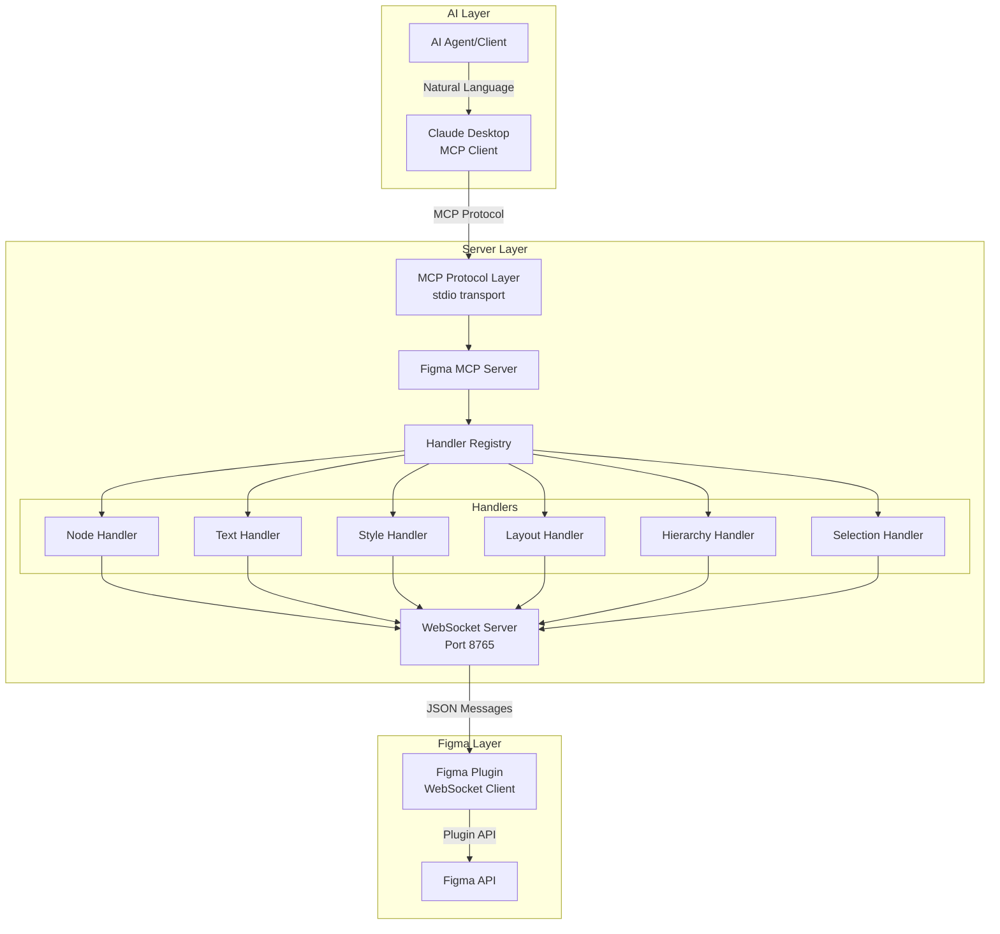
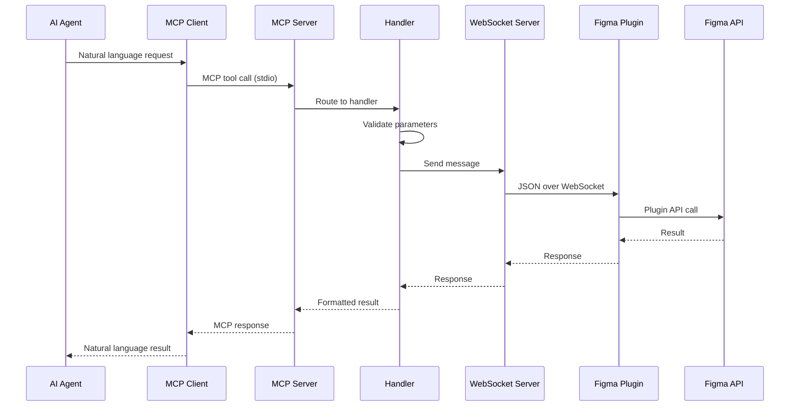

# Development Guide

## 🏗️ Architecture Overview

The Figma MCP Write Server implements a three-layer architecture connecting AI agents to Figma through the Plugin API:



## 📁 Project Structure

```
figma-mcp-write-server/
├── src/                           # MCP Server source code
│   ├── mcp-server.ts             # Main MCP server implementation
│   ├── index.ts                  # CLI entry point and configuration
│   ├── types.ts                  # Type definitions and Zod schemas
│   ├── handlers/                 # Domain-specific tool handlers
│   │   └── index.ts             # Handler registry with auto-discovery
│   ├── utils/                    # Utility functions (color, font, response formatting)
│   └── websocket/                # WebSocket communication layer
├── figma-plugin/                 # Figma plugin source and build
│   ├── src/                     # Plugin TypeScript source
│   │   ├── main.ts              # Plugin entry point
│   │   ├── handlers/            # Plugin-side operation handlers
│   │   ├── utils/               # Plugin utilities (ES5 compatible)
│   │   └── websocket/           # Plugin WebSocket client
│   ├── manifest.json            # Plugin configuration
│   ├── code.js                  # Compiled plugin code (generated at build)
│   ├── ui.html                  # Plugin UI (generated from template)
│   ├── build.js                 # Plugin build script
│   └── tsconfig.json            # Plugin TypeScript config (ES2015 target)
├── tests/                        # Testing infrastructure
├── tools/                        # Build and utility scripts
├── dist/                         # Compiled server output (generated at build)
└── [documentation files]
```

### Architecture Organization

**MCP Server (`src/`)**
- Main server orchestrates MCP protocol and WebSocket communication
- Handlers organize tools by domain (nodes, text, styles, layout, hierarchy, selection)
- Handler registry uses auto-discovery pattern for tool registration
- WebSocket server manages plugin communication with queuing and batching
- Type system provides comprehensive validation with Zod schemas

**Figma Plugin (`figma-plugin/`)**
- TypeScript source compiled to ES2015 (Figma compatibility requirement)
- **Important**: No spread operator (`...`) usage - Figma's environment doesn't support it
- Build process generates `code.js` and `ui.html` from source and templates
- WebSocket client handles reconnection and message routing
- Plugin handlers execute actual Figma API operations

**Build Process**
- Server: TypeScript compilation to `dist/`
- Plugin: Custom build script compiles TypeScript and generates UI
- UI generation: Injects version from package.json into template

## 🔧 Development Environment Setup

### Prerequisites
- Node.js 18+ with npm
- TypeScript knowledge
- Figma account and desktop app
- Understanding of MCP protocol

### Initial Setup
```bash
# Clone the repository
git clone <repository-url>
cd figma-mcp-write-server

# Install dependencies
npm install

# Build everything
npm run build

# Start development server with watch mode
npm run dev
```

### Development Scripts
```bash
npm run build              # Build everything (TypeScript + Plugin)
npm run build:ts          # Build TypeScript only
npm run build:plugin      # Build Figma plugin only
npm run build:plugin:watch # Watch mode for plugin development
npm run dev               # Development mode with auto-restart
npm start                 # Start production server
npm test                  # Run connectivity tests
npm run type-check        # TypeScript validation only
```

## 🏗️ Core Components

### MCP Server (`src/mcp-server.ts`)
The main orchestrator implementing the Model Context Protocol:

- **Protocol Implementation**: Handles MCP tool registration and execution
- **Transport Layer**: Uses stdio transport for MCP client communication
- **WebSocket Integration**: Manages communication with Figma plugin
- **Lifecycle Management**: Coordinates startup/shutdown of all components

### CLI Entry Point (`src/index.ts`)
Command-line interface and application bootstrap:

- **Argument Parsing**: Handles --port, --help, --check-port flags
- **Port Management**: Automatic port detection and conflict resolution
- **Process Management**: Graceful shutdown and error handling
- **Help System**: Usage documentation

### WebSocket Server (`src/websocket/websocket-server.ts`)
Dedicated server for Figma plugin communication:

- **Connection Management**: Handles plugin connections on port 8765
- **Message Routing**: Bidirectional communication with plugin
- **Status Monitoring**: Tracks plugin connection state
- **Error Recovery**: Automatic reconnection handling

## 📋 Handler System

### Handler Registry (`src/handlers/index.ts`)
Central registry with auto-discovery pattern (v0.16.0):

- **Auto-Discovery**: Handlers automatically register via `getTools()` interface method
- **Map-Based Routing**: Replaced switch statement with efficient Map-based request routing
- **Connection Monitoring**: Built-in `get_plugin_status` tool for real-time connection health
- **Enhanced Error Handling**: Comprehensive error reporting with detailed validation messages
- **Type Safety**: Full TypeScript integration with runtime validation using Zod schemas

### Available MCP Tools (v0.16.0)

| Category | Tool | Handler | Description |
|----------|------|---------|-------------|
| **Node Creation** | `create_node` | NodeHandler | Create rectangles, ellipses, frames |
| | `create_text` | TextHandler | Create text with typography |
| **Node Modification** | `update_node` | NodeHandler | Update node properties |
| | `move_node` | NodeHandler | Change node position |
| | `delete_node` | NodeHandler | Remove nodes |
| | `duplicate_node` | NodeHandler | Copy nodes with offset |
| **Style Management** | `manage_styles` | StyleHandler | Create, apply, delete styles |
| **Layout System** | `manage_auto_layout` | LayoutHandler | Configure auto layout |
| | `manage_constraints` | LayoutHandler | Set positioning constraints |
| **Hierarchy** | `manage_hierarchy` | HierarchyHandler | Group, ungroup, reorder nodes |
| **Selection** | `get_selection` | SelectionHandler | Get selected nodes |
| | `set_selection` | SelectionHandler | Set node selection |
| | `get_page_nodes` | SelectionHandler | List all page nodes |
| **Export** | `export_node` | SelectionHandler | Export nodes as images |
| **Status** | `get_plugin_status` | Registry | Check plugin connection |

### Handler Classes

#### Base Handler (`src/handlers/base-handler.ts`)
Shared functionality for all handlers:
- **Parameter Validation**: Common validation patterns using Zod schemas
- **Error Handling**: Standardized error responses with logging
- **Operation Wrapping**: Consistent async operation patterns
- **Default Values**: Parameter default handling

#### Node Handler (`src/handlers/node-handler.ts`)
Core Figma node operations:
- **Node Creation**: Rectangle, ellipse, frame creation with styling
- **Property Updates**: Modify existing node properties
- **Positioning**: Move and position nodes
- **Lifecycle**: Delete and duplicate operations

#### Text Handler (`src/handlers/text-handler.ts`)
Typography and text management:
- **Text Creation**: Rich text with mixed styling support
- **Style Ranges**: Apply different styles to text segments
- **Font Management**: Load and apply custom fonts
- **Typography**: Font size, weight, alignment, spacing

#### Style Handler (`src/handlers/style-handler.ts`)
Figma style system integration:
- **Style Types**: Paint, text, effect, and grid styles
- **CRUD Operations**: Create, read, update, delete styles
- **Style Application**: Apply styles to compatible nodes
- **Style Discovery**: List and search existing styles

#### Layout Handler (`src/handlers/layout-handler.ts`)
Auto layout and constraint system:
- **Auto Layout**: Enable and configure responsive layouts
- **Constraints**: Pin elements and control resizing behavior
- **Spacing**: Configure padding, gaps, and alignment
- **Responsive Design**: Create layouts that adapt to content

#### Hierarchy Handler (`src/handlers/hierarchy-handler.ts`)
Node organization and structure:
- **Grouping**: Create and dissolve groups
- **Layer Order**: Reorder nodes in layer hierarchy
- **Parent-Child**: Move nodes between containers
- **Depth Management**: Control node nesting

#### Selection Handler (`src/handlers/selection-handler.ts`)
Selection and data retrieval:
- **Selection Management**: Get and set selected nodes
- **Page Traversal**: Navigate node hierarchy
- **Data Export**: Extract design information
- **Node Discovery**: Find nodes by criteria

## 🛠️ Utility System

### Node Utilities (`src/utils/node-utils.ts`)
Node traversal and manipulation:
```typescript
findNodeById(id: string): SceneNode | null
getAllNodes(node: BaseNode, depth: number): NodeInfo[]
getNodeIndex(node: SceneNode): number
```

### Color Utilities (`src/utils/color-utils.ts`)
Color format conversions:
```typescript
hexToRgb(hex: string): RGB
hexToRgba(hex: string, alpha: number): RGBA
rgbToHex(color: RGB): string
```

### Font Utilities (`src/utils/font-utils.ts`)
Typography support:
```typescript
loadFont(fontName: FontName): Promise<void>
ensureFontLoaded(fontName: FontName): Promise<void>
getFontFromParams(params: TextParams): FontName
```

### Response Utilities (`src/utils/response-utils.ts`)
Response formatting and validation:
```typescript
createSuccessResponse(data?: any): OperationResult
createErrorResponse(error: string | Error): OperationResult
formatNodeInfo(node: SceneNode): NodeInfo
```

## 📊 Type System (`src/types.ts`)

Enhanced type system with comprehensive validation (v0.16.0):

- **Strongly-Typed Schemas**: Replaced all `z.any()` usage with specific Figma API types
- **Base Schema Inheritance**: Reduced code duplication by 40% through reusable base schemas
- **Generic Communication Types**: `TypedPluginMessage<TPayload>`, `TypedPluginResponse<TData>`
- **Runtime Type Guards**: Safe type checking with detailed error reporting
- **Validation Helpers**: Utility functions for schema parsing and error handling

### Configuration
```typescript
interface ServerConfig {
  port: number;
  enableHeartbeat: boolean;
  heartbeatInterval: number;
  maxReconnectAttempts: number;
}
```

### Operation Parameters
```typescript
interface NodeParams {
  nodeType: 'rectangle' | 'ellipse' | 'frame';
  x?: number;
  y?: number;
  width?: number;
  height?: number;
  fillColor?: string;
  // ... additional properties
}
```

### Response Types
```typescript
interface OperationResult {
  success: boolean;
  data?: any;
  error?: string;
}
```

## 🔄 Communication Protocol

### MCP Tool Execution Flow



### WebSocket Message Format
```typescript
// Request to plugin
{
  id: "uuid",
  type: "CREATE_NODE",
  operation: "createNode", 
  payload: {
    nodeType: "rectangle",
    x: 0, y: 0,
    width: 100, height: 100,
    fillColor: "#FF0000"
  }
}

// Response from plugin
{
  id: "uuid",
  success: true,
  data: {
    nodeId: "figma-node-id",
    message: "Rectangle created successfully"
  }
}
```

## 🧪 Development Workflow

### Adding New MCP Tools

1. **Define Schema** in `src/types.ts`:
```typescript
export const CreateComponentSchema = z.object({
  name: z.string(),
  width: z.number().positive(),
  height: z.number().positive(),
});
```

2. **Register Tool** in `src/handlers/index.ts`:
```typescript
{
  name: 'create_component',
  description: 'Create a new component',
  inputSchema: zodToJsonSchema(CreateComponentSchema),
}
```

3. **Implement Handler** method:
```typescript
async createComponent(params: any): Promise<OperationResult> {
  const validated = CreateComponentSchema.parse(params);
  // Implementation
}
```

4. **Add Plugin Handler** in `figma-plugin/src/handlers/`:
```typescript
export async function createComponent(payload: any): Promise<any> {
  const component = figma.createComponent();
  // Implementation
}
```

### Testing New Features

1. **Unit Tests** for handlers:
```typescript
describe('NodeHandler', () => {
  it('should create rectangle', async () => {
    const handler = new NodeHandler(mockSendToPlugin);
    const result = await handler.createNode({
      nodeType: 'rectangle',
      width: 100,
      height: 100
    });
    expect(result.success).toBe(true);
  });
});
```

2. **Integration Tests** with actual plugin:
```bash
# Start development server
npm run dev

# In separate terminal, run connectivity test
npm test

# Manual testing through MCP client
```

3. **Manual Testing** using test suite:
Follow procedures in `tests/mcp-test-suite.md` for validation.

## 🐛 Debugging

### Server-Side Debugging
```bash
# Enable debug logging
DEBUG=* npm run dev

# Check WebSocket connections
netstat -an | grep 8765

# Monitor process health
ps aux | grep figma-mcp
```

### Plugin-Side Debugging
1. **Figma Console**: Plugins → Development → Open Console
2. **WebSocket Status**: Check plugin UI connection indicator
3. **Message Flow**: Monitor request/response logs
4. **Network Tab**: Verify WebSocket connection in browser dev tools

### Common Issues

#### Plugin Connection Failures
- **Port Conflicts**: Use `--check-port 8765` to identify conflicts
- **Firewall**: Ensure localhost connections allowed
- **Plugin State**: Restart plugin if connection stuck
- **Server State**: Restart server to clear zombie processes

#### Tool Execution Errors
- **Parameter Validation**: Check Zod schema compliance
- **Node Access**: Verify node IDs exist and are accessible
- **Permissions**: Ensure plugin has required Figma permissions
- **File State**: Check file isn't in Dev Mode or locked

#### Performance Issues
- **Message Queue**: Monitor WebSocket message backlog
- **Memory Usage**: Check for memory leaks in long-running sessions
- **Connection Stability**: Monitor reconnection frequency
- **Batch Operations**: Group multiple operations when possible

## 📊 Performance Optimization

### Message Batching
```typescript
// Instead of individual calls
await createNode(params1);
await createNode(params2);

// Batch operations when possible
await batchCreateNodes([params1, params2]);
```

### Connection Management
```typescript
class WebSocketServer {
  private ensureConnection() {
    if (!this.isConnected()) {
      this.reconnect();
    }
  }
}
```

### Caching Strategies
```typescript
class NodeCache {
  private cache = new Map<string, NodeInfo>();
  
  async getNode(id: string): Promise<NodeInfo> {
    if (this.cache.has(id)) {
      return this.cache.get(id)!;
    }
    // Fetch and cache
  }
}
```

## 🔒 Security Best Practices

### Input Validation
All inputs validated with Zod schemas:
```typescript
const params = CreateRectangleSchema.parse(args);
```

### Connection Security
- **Localhost Only**: WebSocket server binds to localhost
- **No Authentication**: Local development only
- **Sandbox**: Plugin runs in Figma's security sandbox
- **Process Isolation**: Server runs as separate process

### Error Handling
Never expose internal errors:
```typescript
catch (error) {
  console.error('Internal error:', error);
  return createErrorResponse('Operation failed');
}
```

## 🚀 Deployment

### Development Mode
```bash
npm run dev          # Auto-restart on changes
npm run dev:plugin   # Plugin watch mode
```

### Production Build
```bash
npm run build        # Build everything
npm start           # Start production server
```

### Environment Configuration
```bash
# Set custom WebSocket port
FIGMA_MCP_PORT=9000 npm start

# Enable debug logging
DEBUG=figma-mcp:* npm start
```

### Monitoring
```bash
# Check server status
curl -f http://localhost:8765/health || echo "Server down"

# Monitor WebSocket connections
ss -tulpn | grep :8765

# Check process health
pgrep -f figma-mcp-write-server
```

## 🧪 Testing Strategy

### Automated Tests
```bash
npm test                    # Run all tests
npm run test:connectivity   # WebSocket connection test
npm run test:manual        # Display manual test guide
```

### Manual Testing Workflow
1. **Setup**: Start server and load plugin
2. **Basic Operations**: Test core functionality
3. **Advanced Features**: Test auto layout, styles, hierarchy
4. **Error Handling**: Test invalid inputs and edge cases
5. **Performance**: Test with large files and many operations

### Test Coverage Areas
- **Parameter Validation**: All Zod schemas
- **Tool Execution**: Each MCP tool
- **Error Handling**: Invalid inputs and failures
- **Connection Management**: WebSocket reliability
- **Plugin Integration**: Figma API compatibility

## 📚 Resources

### Figma Plugin Development
- [Plugin API Reference](https://www.figma.com/plugin-docs/api/api-reference/)
- [Plugin Development Guide](https://www.figma.com/plugin-docs/how-plugins-run/)
- [TypeScript for Plugins](https://www.figma.com/plugin-docs/typescript/)

### Model Context Protocol
- [MCP Specification](https://modelcontextprotocol.io/)
- [MCP TypeScript SDK](https://github.com/modelcontextprotocol/typescript-sdk)
- [MCP Server Examples](https://github.com/modelcontextprotocol/servers)

### Development Tools
- [WebSocket Testing](https://developer.mozilla.org/en-US/docs/Web/API/WebSocket)
- [TypeScript Handbook](https://www.typescriptlang.org/docs/)
- [Zod Validation](https://zod.dev/)

This development guide provides information for understanding, modifying, and extending the Figma MCP Write Server system.