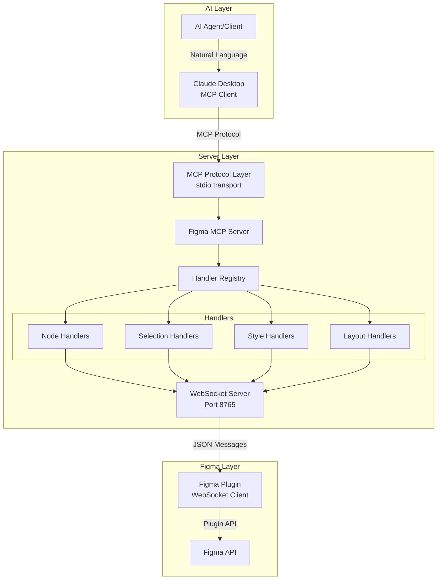

# Development Guide

## 🚀 Quick Start for Contributors

### 5-Minute Setup
```bash
# Clone and setup
git clone <repository-url>
cd figma-mcp-write-server
npm install
npm run build

# Start development
npm run dev
```

### Adding Your First Tool
1. **Define Schema** in `src/types.ts`
2. **Add Handler Method** to appropriate handler class
3. **Register Tool** in handler's `getTools()` method
4. **Test** with `npm test`

### Quick Test
```bash
npm test  # Verify setup works
```

## 🎯 Core Design Principles

MCP servers should be designed from the perspective of both the Human User and their AI Agent. Rather than a thin wrapper around an application API, the design of a MCP server should take into account the Agent Experience ( AX ?) with tools that take into account discoverability and usability.

1. **Logical Tool Consolidation**: Group related operations into single tools with common parameters
3. **ID-Based Operations**: Use explicit node IDs, never selection state dependencies
2. **YAML Response Format**: All tools return structured YAML data within MCP's text field
4. **MCP Protocol Compliance**: Strict adherence to Model Context Protocol standards
5. **Extensible Design**: Easy to add new operations without creating new tools

### 1. Logical Tool Consolidation
**Goal**: Tools are designed to be easily discovered and used by the AI Agent.
**Benefits**: Related operations are grouped into single tools with common operation parameters to simplify discovery and usage. This reduces cognitive load for both the AI agent (fewer tools to understand) and developers (clearer mental model of capabilities).

**✅ Good Consolidation:**
```typescript
create_node(nodeType: "rectangle" | "ellipse" | "frame")
manage_nodes(operation: "move" | "duplicate" | "delete")
manage_hierarchy(operation: "group" | "ungroup")
```

**❌ Over-Atomization:**
```typescript
create_rectangle()
create_ellipse()
move_node()
duplicate_node()
```

**Benefits:**
- **Fewer tools to learn**: Less cognitive load on the AI Agent
- **Consistent patterns**: Similar operations share parameter structures
- **Logical grouping**: Domain-driven organization
- **Extensible**: Add new operations without new tools

### 2. YAML Response Format
**Goal**: Provide structured, human-readable responses that AI agents can reliably parse.
**Benefits**: All tools return structured YAML data within MCP's text field, creating consistency across all operations while remaining human-readable during development and debugging, as well as following the MCP guidelines


```yaml
operation: create_node
result:
  id: "123:456"
  name: "Rectangle"
  type: RECTANGLE
  width: 100
  height: 100
message: "Rectangle created successfully"
```

**Why YAML:**
- **AI Agent Friendly**: Natural for language models to parse
- **Human Readable**: Clear structure during development
- **Consistent**: Uniform format across all tools

### 3. ID-Based Operations
**Goal**: Create stateless, predictable operations that don't depend on UI state.
**Benefits**: All operations use explicit node IDs rather than selection state, making tools more reliable and easier for AI agents to use programmatically.

```typescript
// ✅ Stateless, predictable
manage_nodes(operation: "move", nodeId: "123:456", x: 100, y: 200)

// ❌ Selection-dependent
move_selected_nodes(x: 100, y: 200)
```


### 4. MCP Protocol Compliance
**Goal**: Strict adherence to Model Context Protocol standards for reliable integration.
**Benefits**: Ensures compatibility with all MCP clients and provides consistent behavior across different AI systems. Enables reliable tool discovery and execution patterns.

```typescript
// All tools return this structure
{
  content: [{ 
    type: 'text', 
    text: yamlString // YAML data as string
  }],
  isError: boolean
}

// Success example
{
  content: [{ 
    type: 'text', 
    text: 'operation: create_node\nresult:\n  id: "123:456"\n  type: RECTANGLE'
  }],
  isError: false
}

// Error example  
{
  content: [{ 
    type: 'text', 
    text: 'error: "Node not found"\ntimestamp: "2024-01-01T10:00:00Z"'
  }],
  isError: true
}
```


### 5. Graceful Input Handling
**Goal**: Automatically handle common input issues to reduce friction for AI agents.
**Benefits**: Tools automatically handle edge cases and provide clear error messages with actionable suggestions.


```typescript
// Auto-deduplication
nodeIds: ["123:45", "123:45", "123:46"] → ["123:45", "123:46"]

// Clear error messages with suggestions
error: "Cannot group objects from different containers"
suggestions: ["Ungroup existing groups first"]
```

## 🏗️ How It Works (Simple View)

AI Agent → MCP Protocol → Our Server → WebSocket → Figma Plugin → Figma API

The server translates MCP tool calls into Figma operations and returns structured YAML data.

## 🏗️ Architecture Overview

The Figma MCP Write Server implements a three-layer architecture connecting AI agents to Figma through the Plugin API:



## 📁 Project Structure

```
figma-mcp-write-server/
├── src/                           # MCP Server source code
│   ├── mcp-server.ts             # Main MCP server implementation
│   ├── index.ts                  # CLI entry point and configuration
│   ├── types.ts                  # Type definitions and Zod schemas
│   ├── handlers/                 # Domain-specific tool handlers
│   │   └── index.ts             # Handler registry with auto-discovery
│   ├── utils/                    # Utility functions (color, font, response formatting)
│   └── websocket/                # WebSocket communication layer
├── figma-plugin/                 # Figma plugin source and build
│   ├── src/                     # Plugin TypeScript source
│   │   ├── main.ts              # Plugin entry point
│   │   ├── handlers/            # Plugin-side operation handlers
│   │   ├── utils/               # Plugin utilities (ES5 compatible)
│   │   └── websocket/           # Plugin WebSocket client
│   ├── manifest.json            # Plugin configuration
│   ├── code.js                  # Compiled plugin code (generated at build)
│   ├── ui.html                  # Plugin UI (generated from template)
│   ├── build.js                 # Plugin build script
│   └── tsconfig.json            # Plugin TypeScript config (ES2015 target)
├── tests/                        # Testing infrastructure
├── tools/                        # Build and utility scripts
├── dist/                         # Compiled server output (generated at build)
└── [documentation files]
```

### Architecture Organization

**MCP Server (`src/`)**
- Main server orchestrates MCP protocol and WebSocket communication
- Handlers organize tools by domain (nodes, text, styles, layout, hierarchy, selection)
- Handler registry uses auto-discovery pattern for tool registration
- WebSocket server manages plugin communication with queuing and batching
- Type system provides comprehensive validation with Zod schemas

**Figma Plugin (`figma-plugin/`)**
- TypeScript source compiled to ES2015 (Figma compatibility requirement)
- **Important**: No spread operator (`...`) usage - Figma's environment doesn't support it
- Build process generates `code.js` and `ui.html` from source and templates
- WebSocket client handles reconnection and message routing
- Plugin handlers execute actual Figma API operations

**Build Process**
- Server: TypeScript compilation to `dist/`
- Plugin: Custom build script compiles TypeScript and generates UI
- UI generation: Injects version from package.json into template

## 🔧 Development Environment Setup

### Prerequisites
- Node.js 18+ with npm
- TypeScript knowledge
- Figma account and desktop app
- Understanding of MCP protocol

### Initial Setup
```bash
# Clone the repository
git clone <repository-url>
cd figma-mcp-write-server

# Install dependencies
npm install

# Build everything
npm run build

# Start development server with watch mode
npm run dev
```

### Development Scripts
```bash
npm run build              # Build everything (TypeScript + Plugin)
npm run build:ts          # Build TypeScript only
npm run build:plugin      # Build Figma plugin only
npm run build:plugin:watch # Watch mode for plugin development
npm run dev               # Development mode with auto-restart
npm start                 # Start production server
npm test                  # Run connectivity tests
npm run type-check        # TypeScript validation only
```

## 🏗️ Core Components

### MCP Server (`src/mcp-server.ts`)
The main orchestrator implementing the Model Context Protocol:

- **Protocol Implementation**: Handles MCP tool registration and execution
- **Transport Layer**: Uses stdio transport for MCP client communication
- **WebSocket Integration**: Manages communication with Figma plugin
- **Lifecycle Management**: Coordinates startup/shutdown of all components

### CLI Entry Point (`src/index.ts`)
Command-line interface and application bootstrap:

- **Argument Parsing**: Handles --port, --help, --check-port flags
- **Port Management**: Automatic port detection and conflict resolution
- **Process Management**: Graceful shutdown and error handling
- **Help System**: Usage documentation

### WebSocket Server (`src/websocket/websocket-server.ts`)
Dedicated server for Figma plugin communication:

- **Connection Management**: Handles plugin connections on port 8765
- **Message Routing**: Bidirectional communication with plugin
- **Status Monitoring**: Tracks plugin connection state
- **Error Recovery**: Automatic reconnection handling

## 📋 Handler System

### Handler Registry (`src/handlers/index.ts`)
Central registry with auto-discovery pattern:

- **Auto-Discovery**: Handlers automatically register via `getTools()` interface method
- **Map-Based Routing**: Efficient Map-based request routing for tool execution
- **Connection Monitoring**: Built-in `get_plugin_status` and `get_connection_health` tools
- **YAML Response Format**: Consistent YAML output for structured data within MCP text format
- **Enhanced Error Handling**: Comprehensive error reporting with timestamps and operation context
- **Type Safety**: Full TypeScript integration with runtime validation using Zod schemas

### Available MCP Tools

The server provides 14 consolidated tools organized by domain. See README.md for complete tool documentation.

### Handler Classes

#### Node Handlers (`src/handlers/node-handlers.ts`)
Core Figma node operations:
- **Node Creation**: Rectangle, ellipse, frame, text creation with `create_node` and `create_text`
- **Property Updates**: Modify existing node properties with `update_node`
- **Node Management**: Move, delete, duplicate operations with `manage_nodes`
- **Advanced Typography**: Rich text with mixed styling and font management
- **YAML Responses**: Structured data output in human-readable format

#### Selection Handlers (`src/handlers/selection-handlers.ts`)
Selection and page management:
- **Selection Operations**: Get and set selected nodes with `get_selection` and `set_selection`
- **Page Traversal**: Navigate node hierarchy with `get_page_nodes`
- **Data Export**: Extract design information with `export_node`
- **Filtering**: Find nodes by type, visibility, and other criteria
- **Enhanced Validation**: Better error reporting with actionable suggestions

#### Style Handlers (`src/handlers/style-handlers.ts`)
Figma style system integration:
- **Style Types**: Paint, text, effect, and grid styles via `manage_styles`
- **CRUD Operations**: Create, read, update, delete styles
- **Style Application**: Apply styles to compatible nodes
- **Style Discovery**: List and search existing styles
- **Comprehensive Management**: All style operations in a single unified tool

#### Layout Handlers (`src/handlers/layout-handlers.ts`)
Auto layout, constraints, and hierarchy:
- **Auto Layout**: Enable and configure responsive layouts with `manage_auto_layout`
- **Constraints**: Pin elements and control resizing with `manage_constraints`
- **Hierarchy Management**: Group, ungroup, and reorder nodes with `manage_hierarchy`
- **MCP Specification Compliance**: Enhanced grouping with deduplication and validation
- **Responsive Design**: Create layouts that adapt to content and screen sizes

## 🛠️ Adding a New Tool: Step-by-Step Example

Let's add a "rotate_node" operation to `manage_nodes`:

### Step 1: Define Schema (types.ts)
```typescript
export const RotateNodeSchema = z.object({
  operation: z.literal("rotate"),
  nodeId: z.string(),
  rotation: z.number() // degrees
});

// Add to existing ManageNodesSchema union
export const ManageNodesSchema = z.discriminatedUnion("operation", [
  MoveNodeSchema,
  DuplicateNodeSchema,
  DeleteNodeSchema,
  RotateNodeSchema // Add this
]);
```

### Step 2: Add Handler Method (handlers/node-handlers.ts)
```typescript
private async rotateNode(params: RotateNodeParams): Promise<OperationResult> {
  const response = await this.sendToPlugin({
    type: 'ROTATE_NODE',
    payload: {
      nodeId: params.nodeId,
      rotation: params.rotation
    }
  });

  return this.createSuccessResponse({
    operation: 'rotate',
    nodeId: params.nodeId,
    rotation: params.rotation,
    message: `Node rotated ${params.rotation} degrees`
  });
}

// Update manageNodes method to handle new operation
async manageNodes(params: any): Promise<OperationResult> {
  const validated = ManageNodesSchema.parse(params);

  switch (validated.operation) {
    case 'move': return this.moveNode(validated);
    case 'duplicate': return this.duplicateNode(validated);
    case 'delete': return this.deleteNode(validated);
    case 'rotate': return this.rotateNode(validated); // Add this
  }
}
```

### Step 3: Add Plugin Handler (figma-plugin/src/handlers/node-operations.ts)
```typescript
export async function rotateNode(payload: any): Promise<any> {
  const node = figma.getNodeById(payload.nodeId);
  if (!node) {
    throw new Error(`Node ${payload.nodeId} not found`);
  }

  node.rotation = payload.rotation * (Math.PI / 180); // Convert to radians

  return {
    success: true,
    nodeId: payload.nodeId,
    rotation: payload.rotation
  };
}
```

### Step 4: Register Handler (figma-plugin/src/main.ts)
```typescript
// Add to message handler switch
case 'ROTATE_NODE':
  result = await nodeOperations.rotateNode(message.payload);
  break;
```

### Step 5: Test
```bash
npm run build
npm test
# Test with: manage_nodes(operation: "rotate", nodeId: "123:456", rotation: 45)
```

## 🧪 Testing Your Changes

### Quick Validation
```bash
npm test                    # Basic connectivity
npm run test:manual        # Manual test guide
```

### Manual Testing Checklist
1. **Setup**: Start `npm run dev` and load Figma plugin
2. **Tool Discovery**: Verify tool appears in MCP client
3. **Valid Input**: Test with correct parameters
4. **Invalid Input**: Test parameter validation
5. **Error Cases**: Test with non-existent node IDs
6. **Response Format**: Verify YAML structure

## 🎯 Implementation Principles

### MCP Protocol Compliance
The server strictly adheres to Model Context Protocol standards:
- **Text-Based Responses**: All tools return `{ content: [{ type: 'text', text: string }], isError: boolean }`
- **Structured Data**: YAML format within text content for human-readable structured output
- **Error Handling**: Consistent error format with operation context and timestamps
- **Tool Definitions**: JSON Schema-based input validation for all parameters

#### Parameter Design Patterns

**Base Schema Inheritance:**
```typescript
// Shared base properties reduce duplication
export const BaseNodePropertiesSchema = BasePositionSchema
  .merge(BaseSizeSchema)
  .merge(BaseVisualSchema)
  .merge(BaseStrokeSchema)
  .merge(BaseCornerSchema)
  .extend({ name: z.string().optional() });

// Tools extend base schemas
export const CreateNodeSchema = BaseNodePropertiesSchema.extend({
  nodeType: z.enum(['rectangle', 'ellipse', 'text', 'frame', 'star', 'polygon'])
});
```

**Operation-Based Parameters:**
```typescript
// Tools use operation enum for different behaviors
{
  "operation": "group",           // Required discriminator
  "nodeIds": ["1", "2", "3"],    // Operation-specific parameters
  "name": "Navigation Group"      // Optional metadata
}

{
  "operation": "move",
  "nodeId": "123",
  "x": 100,
  "y": 50
}
```

**Smart Defaults:**
```typescript
// Sensible defaults reduce parameter complexity
export const CreateTextSchema = BaseTextSchema.extend({
  fontFamily: z.string().default("Inter"),      // Industry standard
  fontSize: z.number().default(16),             // Readable default
  lineHeightUnit: z.enum(["px", "percent"]).default("percent")
});
```

#### Error Handling Strategy

**Structured Error Responses:**
```typescript
// Consistent error format across all tools
const errorData = {
  error: 'Failed to create node: Invalid color format',
  operation: 'create_node',
  tool: 'create_node',
  timestamp: new Date().toISOString(),
  suggestion: 'Use hex format like #FF0000 for colors'
};

return {
  content: [{ type: 'text', text: yaml.dump(errorData) }],
  isError: true
};
```

**Validation-First Approach:**
```typescript
// All inputs validated before processing
try {
  const validatedParams = CreateNodeSchema.parse(args);
  // Process with guaranteed valid data
} catch (error) {
  if (error instanceof z.ZodError) {
    const issues = error.errors.map(issue =>
      `${issue.path.join('.')}: ${issue.message}`
    ).join(', ');
    throw new Error(`Validation failed: ${issues}`);
  }
}
```

#### WebSocket Communication Protocol

**Message Flow Design:**
```typescript
// Request format
{
  id: "uuid-v4",                    // Unique request ID
  type: "CREATE_NODE",              // Operation type
  payload: {                        // Validated parameters
    nodeType: "rectangle",
    width: 100,
    height: 100
  }
}

// Response format
{
  id: "uuid-v4",                    // Matching request ID
  success: true,                    // Operation status
  data: {                           // Operation result
    nodeId: "figma-node-id",
    message: "Rectangle created"
  }
}
```

**Queue Management:**
```typescript
// Priority-based request handling
interface QueuedRequest {
  priority: 'low' | 'normal' | 'high';
  timeout: NodeJS.Timeout;
  retries: number;
  timestamp: number;
}
```

#### Handler Organization Principles

**Domain-Driven Separation:**
- **NodeHandlers**: Creation, modification, basic operations
- **SelectionHandlers**: Page traversal, selection management, export
- **StyleHandlers**: Style system integration (paint, text, effect, grid)
- **LayoutHandlers**: Auto layout, constraints, hierarchy management

**Dependency Injection:**
```typescript
// Handlers receive communication function, not direct WebSocket
export class NodeHandlers implements ToolHandler {
  constructor(private sendToPlugin: (request: any) => Promise<any>) {}
}

// Enables testing and decoupling
const mockSend = jest.fn().mockResolvedValue({ success: true });
const handler = new NodeHandlers(mockSend);
```

#### Type Safety & Validation

**Runtime Type Checking:**
```typescript
// Zod schemas provide both TypeScript types and runtime validation
export const CreateNodeSchema = z.object({
  nodeType: z.enum(['rectangle', 'ellipse']),
  width: z.number().positive(),
  height: z.number().positive()
});

export type CreateNodeParams = z.infer<typeof CreateNodeSchema>;

// Usage guarantees type safety
function createNode(params: unknown): CreateNodeParams {
  return CreateNodeSchema.parse(params); // Throws on invalid input
}
```

**Generic Communication Types:**
```typescript
// Type-safe WebSocket communication
interface TypedPluginMessage<TPayload = unknown> {
  id: string;
  type: string;
  payload?: TPayload;
}

interface TypedPluginResponse<TData = unknown> {
  id: string;
  success: boolean;
  data?: TData;
  error?: string;
}
```

#### Performance Considerations

**Efficient Tool Discovery:**
```typescript
// Map-based handler lookup O(1) instead of linear search
private handlers = new Map<string, ToolHandler>();

// Handler registration during initialization
tools.forEach(tool => {
  this.handlers.set(tool.name, handler);
});
```

**Message Batching:**
```typescript
// Multiple operations can be batched for performance
if (this.shouldBatchRequests()) {
  this.processBatchedRequests();
} else {
  this.processIndividualRequest();
}
```

#### Figma-Specific Considerations

**ES2015 Compatibility:**
```typescript
// Plugin code must be ES2015 compatible (no spread operator)
// ❌ const newObj = { ...existingObj, newProp: 'value' };
// ✅ const newObj = Object.assign({}, existingObj, { newProp: 'value' });
```

**Font Loading:**
```typescript
// Fonts must be loaded before text operations
await figma.loadFontAsync({ family: 'Inter', style: 'Regular' });
```

**Color Format Conversion:**
```typescript
// Figma uses 0-1 RGB values, users provide hex
function hexToRgb(hex: string): RGB {
  const r = parseInt(hex.slice(1, 3), 16) / 255;
  const g = parseInt(hex.slice(3, 5), 16) / 255;
  const b = parseInt(hex.slice(5, 7), 16) / 255;
  return { r, g, b };
}
```

#### Security & Robustness

**Input Sanitization:**
```typescript
// All inputs validated through Zod schemas
// No direct parameter access without validation
const params = CreateNodeSchema.parse(args); // Safe to use
```

**Timeout Management:**
```typescript
// Operation-specific timeouts prevent hanging
private getTimeoutForOperation(operationType: string): number {
  return this.config.communication.operationTimeouts[operationType] ||
         this.config.communication.defaultTimeout;
}
```

**Connection Health Monitoring:**
```typescript
// Continuous health checks and reconnection logic
private updateConnectionHealth(): void {
  if (!this.pluginConnection) {
    this.connectionStatus.connectionHealth = 'unhealthy';
  } else if (this.averageResponseTime > 10000) {
    this.connectionStatus.connectionHealth = 'degraded';
  } else {
    this.connectionStatus.connectionHealth = 'healthy';
  }
}
```

### Development Guidelines

**Adding New Tools:**
1. **Schema First**: Define Zod schema in `types.ts`
2. **Handler Integration**: Add to appropriate handler class
3. **Tool Registration**: Update `getTools()` method
4. **Documentation**: Add examples to EXAMPLES.md
5. **Testing**: Validate with manual test suite

**Maintaining Consistency:**
- Use YAML response format for all tools
- Follow operation-based parameter patterns
- Include timestamps in error responses
- Provide actionable error messages
- Test with actual Figma plugin integration

**Performance Best Practices:**
- Batch related operations when possible
- Use efficient data structures (Maps over arrays for lookups)
- Implement proper timeout and retry logic
- Monitor WebSocket connection health
- Cache frequently accessed data when appropriate

## 🛠️ Utility System

### Node Utilities (`src/utils/node-utils.ts`)
Node traversal and manipulation:
```typescript
findNodeById(id: string): SceneNode | null
getAllNodes(node: BaseNode, depth: number): NodeInfo[]
getNodeIndex(node: SceneNode): number
```

### Color Utilities (`src/utils/color-utils.ts`)
Color format conversions:
```typescript
hexToRgb(hex: string): RGB
hexToRgba(hex: string, alpha: number): RGBA
rgbToHex(color: RGB): string
```

### Font Utilities (`src/utils/font-utils.ts`)
Typography support:
```typescript
loadFont(fontName: FontName): Promise<void>
ensureFontLoaded(fontName: FontName): Promise<void>
getFontFromParams(params: TextParams): FontName
```

### Response Utilities (`src/utils/response-utils.ts`)
Response formatting and validation:
```typescript
createSuccessResponse(data?: any): OperationResult
createErrorResponse(error: string | Error): OperationResult
formatNodeInfo(node: SceneNode): NodeInfo
```

## 📊 Type System (`src/types.ts`)

Enhanced type system with comprehensive validation (v0.16.0):

- **Strongly-Typed Schemas**: Replaced all `z.any()` usage with specific Figma API types
- **Base Schema Inheritance**: Reduced code duplication by 40% through reusable base schemas
- **Generic Communication Types**: `TypedPluginMessage<TPayload>`, `TypedPluginResponse<TData>`
- **Runtime Type Guards**: Safe type checking with detailed error reporting
- **Validation Helpers**: Utility functions for schema parsing and error handling

### Configuration
```typescript
interface ServerConfig {
  port: number;
  enableHeartbeat: boolean;
  heartbeatInterval: number;
  maxReconnectAttempts: number;
}
```

### Operation Parameters
```typescript
interface NodeParams {
  nodeType: 'rectangle' | 'ellipse' | 'frame';
  x?: number;
  y?: number;
  width?: number;
  height?: number;
  fillColor?: string;
  // ... additional properties
}
```

### Response Types
```typescript
interface OperationResult {
  success: boolean;
  data?: any;
  error?: string;
}
```

## 🔄 Communication Protocol

### MCP Tool Execution Flow


### WebSocket Message Format
```typescript
// Request to plugin
{
  id: "uuid",
  type: "CREATE_NODE",
  operation: "createNode",
  payload: {
    nodeType: "rectangle",
    x: 0, y: 0,
    width: 100, height: 100,
    fillColor: "#FF0000"
  }
}

// Response from plugin
{
  id: "uuid",
  success: true,
  data: {
    nodeId: "figma-node-id",
    message: "Rectangle created successfully"
  }
}
```

## 🧪 Development Workflow

### Adding New MCP Tools

1. **Define Schema** in `src/types.ts`:
```typescript
export const CreateComponentSchema = z.object({
  name: z.string(),
  width: z.number().positive(),
  height: z.number().positive(),
});
```

2. **Register Tool** in `src/handlers/index.ts`:
```typescript
{
  name: 'create_component',
  description: 'Create a new component',
  inputSchema: zodToJsonSchema(CreateComponentSchema),
}
```

3. **Implement Handler** method:
```typescript
async createComponent(params: any): Promise<OperationResult> {
  const validated = CreateComponentSchema.parse(params);
  // Implementation
}
```

4. **Add Plugin Handler** in `figma-plugin/src/handlers/`:
```typescript
export async function createComponent(payload: any): Promise<any> {
  const component = figma.createComponent();
  // Implementation
}
```

### Testing New Features

1. **Unit Tests** for handlers:
```typescript
describe('NodeHandler', () => {
  it('should create rectangle', async () => {
    const handler = new NodeHandler(mockSendToPlugin);
    const result = await handler.createNode({
      nodeType: 'rectangle',
      width: 100,
      height: 100
    });
    expect(result.success).toBe(true);
  });
});
```

2. **Integration Tests** with actual plugin:
```bash
# Start development server
npm run dev

# In separate terminal, run connectivity test
npm test

# Manual testing through MCP client
```

3. **Manual Testing** using test suite:
Follow procedures in `tests/mcp-test-suite.md` for validation.

## 🐛 Debugging

### Server-Side Debugging
```bash
# Enable debug logging
DEBUG=* npm run dev

# Check WebSocket connections
netstat -an | grep 8765

# Monitor process health
ps aux | grep figma-mcp
```

### Plugin-Side Debugging
1. **Figma Console**: Plugins → Development → Open Console
2. **WebSocket Status**: Check plugin UI connection indicator
3. **Message Flow**: Monitor request/response logs
4. **Network Tab**: Verify WebSocket connection in browser dev tools

### Common Issues

#### Plugin Connection Failures
- **Port Conflicts**: Use `--check-port 8765` to identify conflicts
- **Firewall**: Ensure localhost connections allowed
- **Plugin State**: Restart plugin if connection stuck
- **Server State**: Restart server to clear zombie processes

#### Tool Execution Errors
- **Parameter Validation**: Check Zod schema compliance
- **Node Access**: Verify node IDs exist and are accessible
- **Permissions**: Ensure plugin has required Figma permissions
- **File State**: Check file isn't in Dev Mode or locked

#### Performance Issues
- **Message Queue**: Monitor WebSocket message backlog
- **Memory Usage**: Check for memory leaks in long-running sessions
- **Connection Stability**: Monitor reconnection frequency
- **Batch Operations**: Group multiple operations when possible

## 📊 Performance Optimization

### Message Batching
```typescript
// Instead of individual calls
await createNode(params1);
await createNode(params2);

// Batch operations when possible
await batchCreateNodes([params1, params2]);
```

### Connection Management
```typescript
class WebSocketServer {
  private ensureConnection() {
    if (!this.isConnected()) {
      this.reconnect();
    }
  }
}
```

### Caching Strategies
```typescript
class NodeCache {
  private cache = new Map<string, NodeInfo>();

  async getNode(id: string): Promise<NodeInfo> {
    if (this.cache.has(id)) {
      return this.cache.get(id)!;
    }
    // Fetch and cache
  }
}
```

## 🔒 Security Best Practices

### Input Validation
All inputs validated with Zod schemas:
```typescript
const params = CreateRectangleSchema.parse(args);
```

### Connection Security
- **Localhost Only**: WebSocket server binds to localhost
- **No Authentication**: Local development only
- **Sandbox**: Plugin runs in Figma's security sandbox
- **Process Isolation**: Server runs as separate process

### Error Handling
Never expose internal errors:
```typescript
catch (error) {
  console.error('Internal error:', error);
  return createErrorResponse('Operation failed');
}
```

## 🚀 Deployment

### Development Mode
```bash
npm run dev          # Auto-restart on changes
npm run dev:plugin   # Plugin watch mode
```

### Production Build
```bash
npm run build        # Build everything
npm start           # Start production server
```

### Environment Configuration
```bash
# Set custom WebSocket port
FIGMA_MCP_PORT=9000 npm start

# Enable debug logging
DEBUG=figma-mcp:* npm start
```

### Monitoring
```bash
# Check server status
curl -f http://localhost:8765/health || echo "Server down"

# Monitor WebSocket connections
ss -tulpn | grep :8765

# Check process health
pgrep -f figma-mcp-write-server
```

## 🧪 Testing Strategy

### Automated Tests
```bash
npm test                    # Run all tests
npm run test:connectivity   # WebSocket connection test
npm run test:manual        # Display manual test guide
```

### Manual Testing Workflow
1. **Setup**: Start server and load plugin
2. **Basic Operations**: Test core functionality
3. **Advanced Features**: Test auto layout, styles, hierarchy
4. **Error Handling**: Test invalid inputs and edge cases
5. **Performance**: Test with large files and many operations

### Test Coverage Areas
- **Parameter Validation**: All Zod schemas
- **Tool Execution**: Each MCP tool
- **Error Handling**: Invalid inputs and failures
- **Connection Management**: WebSocket reliability
- **Plugin Integration**: Figma API compatibility

## 📚 Resources

### Figma Plugin Development
- [Plugin API Reference](https://www.figma.com/plugin-docs/api/api-reference/)
- [Plugin Development Guide](https://www.figma.com/plugin-docs/how-plugins-run/)
- [TypeScript for Plugins](https://www.figma.com/plugin-docs/typescript/)

### Model Context Protocol
- [MCP Specification](https://modelcontextprotocol.io/)
- [MCP TypeScript SDK](https://github.com/modelcontextprotocol/typescript-sdk)
- [MCP Server Examples](https://github.com/modelcontextprotocol/servers)

### Development Tools
- [WebSocket Testing](https://developer.mozilla.org/en-US/docs/Web/API/WebSocket)
- [TypeScript Handbook](https://www.typescriptlang.org/docs/)
- [Zod Validation](https://zod.dev/)

This development guide provides information for understanding, modifying, and extending the Figma MCP Write Server system.
