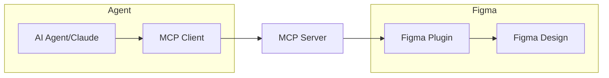

# Figma MCP Write Server

A Model Context Protocol (MCP) server that provides **write access** to Figma through the Plugin API, enabling AI agents to create, modify, and manage Figma designs programmatically.

Designed with ❤️ by a human. Coded with ✨ by an AI agent.

> [!WARNING]
> This project in in pre-release development mode (Semantic Versioning < 1.0.0) this means that all tools, interfaces and definitions are subject to change.


## 🚀 Overview

Because the Figma REST API is mostly read-only, this project uses the Plugin API to enable full write operations. This allows AI agents to:

- ✅ **Create** design elements (rectangles, ellipses, text, frames)
- ✅ **Typography** with mixed styling and text formatting
- ✅ **Style Management** for paint, text, effect, and grid styles
- ✅ **Auto Layout & Constraints** for responsive design
- ✅ **Layer & Hierarchy** management (grouping, reordering)
- ✅ **Component System** for design systems and reusable components
- ✅ **Variables & Design Tokens** for design system consistency
- ✅ **Boolean Operations** for advanced shape creation (union, subtract, intersect, exclude)
- ✅ **Vector Operations** for custom path creation and manipulation
- ✅ **Dev Mode Integration** for design-to-development handoff workflows
- ✅ **Design Annotations** for developer communication and specifications
- ✅ **Measurements** for spacing and sizing specifications
- ✅ **CSS Generation** and development status tracking
- ✅ **Modify** existing nodes (properties, position, styling)
- ✅ **Delete** and duplicate design elements
- ✅ **Manage** selections and page content
- ✅ **Export** designs programmatically with flexible file/data output options
- ✅ **Image Management** for loading, filtering, and transforming images applied to design elements
- ✅ **Font Management** with SQLite database for fast search across 37K+ fonts

## 🏗️ Architecture



1. **AI Agent** calls MCP tools (e.g., `figma_nodes` with operation `create`)
2. **MCP Server** validates parameters and routes to handlers
3. **Figma Plugin** receives message and executes operation
4. **Results** are sent back to the MCP server and AI agent

## 📋 Available MCP Tools

| Tool | Description | Parameters |
|------|-------------|------------|
| `figma_nodes` | Create, update, move, delete, or duplicate nodes | operation (create/update/move/delete/duplicate), nodeType, nodeId, position, size, styling properties |
| `figma_text` | Create and manage text with typography features | operation (create/update/character_styling/apply_text_style/create_text_style), characters, fontFamily, fontSize, styleRanges, textAlign |
| `figma_components` | Component management (create, create_set, add_variant, get) | operation, nodeId, componentIds, componentId, name, description, variantProperties |
| `figma_instances` | Instance management (create, swap, detach, reset_overrides, set_override, get) | operation, componentId, instanceId, x, y, overrides, swapTarget |
| `figma_styles` | Style management (paint, text, effect, grid) | operation, styleType, styleName, color, fontSize, effects |
| `figma_collections` | Variable collection management (create, update, delete, get, list) | operation, collectionId, collectionName, modes, modeId, newModeName, description |
| `figma_variables` | Variable management and binding (create, bind, unbind, get_bindings) | operation, variableId, collectionId, variableName, variableType, nodeId, property, modeValues |
| `figma_boolean_operations` | Boolean operations on shapes (union, subtract, intersect, exclude) | operation, nodeIds, name, preserveOriginal |
| `figma_vector_operations` | Vector creation and manipulation (create, flatten, outline_stroke, get_paths) | operation, nodeId, vectorPaths, name, strokeWidth, x, y |
| `figma_annotations` | Design annotations for dev handoff (add, edit, remove, list) | operation, nodeId, annotationId, label, labelMarkdown, properties, categoryId |
| `figma_measurements` | Spacing and sizing measurements (add, edit, remove, list) | operation, measurementId, fromNodeId, toNodeId, direction, label, customValue, pageId |
| `figma_dev_resources` | CSS generation and dev status tracking (generate_css, set_dev_status, add_dev_link, remove_dev_link, get_dev_resources) | operation, nodeId, status, linkUrl, linkTitle, linkId, cssOptions |
| `figma_auto_layout` | Auto layout configuration | operation, nodeId, direction, spacing, padding, alignment, resizing |
| `figma_constraints` | Constraints management | operation, nodeId, horizontal, vertical |
| `figma_alignment` | Node alignment and positioning with reference point control | nodeIds, horizontalOperation/Direction, verticalOperation/Direction, referenceMode, referencePoints, alignmentPoints, spacing |
| `figma_hierarchy` | Layer & hierarchy management with grouping | operation, nodeId, nodeIds, name, groupType |
| *Consolidated into `figma_nodes`* | Update node properties | Use `figma_nodes` with operation `update` |
| *Consolidated into `figma_nodes`* | Move, delete, or duplicate nodes | Use `figma_nodes` with operations `move`, `delete`, `duplicate` |
| `figma_selection` | Get/set selection or get page hierarchy | operation (get_current/set_nodes/get_page_hierarchy), nodeIds, detail, filters |
| *Consolidated into `figma_selection`* | Set node selection | Use `figma_selection` with operation `set_nodes` |
| *Consolidated into `figma_selection`* | List all nodes on current page | Use `figma_selection` with operation `get_page_hierarchy` |
| `figma_exports` | Export nodes as files or data with cross-platform output control | operation, nodeId/nodeIds, format, output (file/data), outputDirectory, dataFormat |
| `figma_images` | Image management for design elements | operation, imageUrl/imageBytes, nodeId, createNode, scaleMode, filters, rotation, alignmentX/Y, fitStrategy |
| `figma_fonts` | Font search and management with SQLite database | operation (search_fonts/get_project_fonts/get_font_count/check_availability/get_font_styles/validate_font/get_font_info/preload_fonts), query, source, hasStyle, minStyleCount, limit, sortBy |
| `figma_plugin_status` | Check plugin connection and health | operation (status/health/test), testType, timeout |
| *Consolidated into `figma_plugin_status`* | Get detailed connection metrics | Use `figma_plugin_status` with operation `health` |

## 🎯 Usage Examples

Common use cases:
- **Create Layout**: "Create a header frame with title and subtitle"
- **Auto Layout**: "Make this frame arrange its children vertically with 16px spacing"
- **Alignment**: "Center text within frame" or "Align circle's center to rectangle's left edge"
- **Constraints**: "Pin this sidebar to the left and stretch to full height"
- **Typography**: "Make a styled heading with mixed formatting"
- **Design System**: "Create color palette and apply styles consistently"
- **Variables**: "Create design tokens for colors and spacing, bind to components"
- **Components**: "Build button variants with different colors and styles"
- **Boolean Operations**: "Combine shapes with union, create cutouts with subtract"
- **Vector Creation**: "Create custom icons with SVG paths and flatten complex shapes"
- **Dev Handoff**: "Add annotations and measurements, generate CSS for developers"
- **Image Operations**: "Load hero image from URL and apply filters" or "Replace product images with smart cropping"
- **Font Search**: "Find Google fonts with Bold style" or "Search fonts matching 'Inter'"
- **Batch Operations**: "Select all text elements and update font size"
- **Export Operations**: "Export selected components as PNG files to default export folder" or "Return design data as base64 for processing"

📚 **[Examples & Usage Guide →](EXAMPLES.md)**

## 🛠️ Installation & Setup

### Command Line Options
- `--port <number>` - WebSocket server port (default: 3000)
- `--help, -h` - Show help message

### Plugin Build System
The Figma plugin uses a configurable build system that automatically matches the server port:

```bash
# Build plugin with default port (3000)
cd figma-plugin && node build.js

# Build plugin with custom port
cd figma-plugin && node build.js --port=8765

# Watch mode for development
cd figma-plugin && node build.js --watch --port=3000
```

The build system automatically injects the correct WebSocket port and version into the plugin UI, ensuring the plugin always connects to the right server port.

### Configuration
The server uses YAML configuration files with platform-specific defaults:

- **Windows**: `%APPDATA%\figma-mcp-write-server\config.yaml`
- **macOS**: `~/Library/Application Support/figma-mcp-write-server/config.yaml`
- **Linux**: `~/.config/figma-mcp-write-server/config.yaml`

Configuration files are automatically created on first run. See `config.example.yaml` for all available options.

### Font Database
SQLite database for fast font search is automatically configured:

- **Windows**: `%LOCALAPPDATA%\figma-mcp-write-server\fonts.db`
- **macOS**: `~/Library/Caches/figma-mcp-write-server/fonts.db`
- **Linux**: `~/.cache/figma-mcp-write-server/fonts.db`

Database synchronizes automatically with Figma's available fonts.

### Platform Support
The export system supports Windows and macOS with automatic platform detection:
- **Windows**: `~/Documents/Figma Exports`
- **macOS**: `~/Downloads/Figma Exports`

**Note**: Linux and other Unix-like systems are not currently supported for export operations.

## 🚦 Connection Status

The system provides real-time connection monitoring:

- **MCP Server**: Logs all client connections and tool calls
- **Figma Plugin UI**: Shows WebSocket connection status
- **Status Tool**: Use `get_plugin_status` to check connectivity

## 🔍 Troubleshooting

### Plugin Won't Connect
1. Check WebSocket port (default: 3000) - ensure plugin was built with matching port
2. Verify MCP server is running
3. Verify Figma plugin is running
4. Check plugin console for connection logs
5. Plugin automatically reconnects on connection loss

### Write Operations Fail
1. Ensure plugin is connected (`get_plugin_status`)
2. Check node IDs are valid
3. Verify Figma file is not in Dev Mode
4. Check plugin permissions

### Performance Issues
1. Reduce heartbeat interval
2. Limit concurrent operations
3. Use batch operations when possible
4. Monitor WebSocket message size

## 🆚 Comparison with REST API MCP Servers

| Feature | REST API MCP | Plugin API MCP (This Project) |
|---------|--------------|-------------------------------|
| **Read Operations** | ✅ Full access | ✅ Full access |
| **Write Operations** | ❌ Not supported | ✅ Full support |
| **Real-time Updates** | ❌ Polling only | ✅ Live connection |
| **Authentication** | API Token | Plugin permissions |
| **Setup Complexity** | Simple | Moderate (requires plugin) |
| **Rate Limits** | Yes (REST API limits) | No (direct plugin access) |
| **Offline Usage** | ✅ Works offline | ❌ Requires active Figma session |

## 🛡️ Security Considerations

- WebSocket connections are local-only by default
- Plugin runs in Figma's sandbox environment
- No sensitive data stored in plugin code
- Message validation using Zod schemas
- Connection authentication via plugin ID

## 🚧 Limitations

- Requires active Figma session (desktop/browser)
- Plugin must be manually installed and run
- WebSocket connection can be unstable on poor networks
- Some Figma features may not be supported
- Limited to single file operations (current page)

## 📚 Documentation

- **[Development Guide](DEVELOPMENT.md)** - Setup, architecture, and contribution guidelines
- **[Changelog](CHANGELOG.md)** - Version history and updates

## 📄 License

This project is licensed under the MIT License - see the [LICENSE](LICENSE) file for details.

## 🤝 Contributing

Contributions are welcome! Please see the [Development Guide](DEVELOPMENT.md) for guidelines.

---

**Note**: This project provides write access to Figma designs through MCP by using Figma's Plugin API, which enables creation and modification operations not available through the REST API. The server includes 21 MCP tools and runs a WebSocket server on port 3000 (configurable) for plugin communication.
