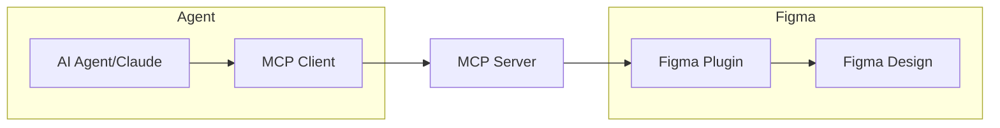

# Figma MCP Write Server

A Model Context Protocol (MCP) server that provides **write access** to Figma through the Plugin API, enabling AI agents to create, modify, and manage Figma designs programmatically.

_Designed and Architected with ❤️ by a real human. Coded by an AI Assistant._

## 🚀 Overview

Because the Figma REST API is mostly read-only, this project uses the Plugin API to enable full write operations. This allows AI agents to:

- ✅ **Create** design elements (rectangles, ellipses, text, frames)
- ✅ **Typography** with mixed styling and text formatting
- ✅ **Style Management** for paint, text, effect, and grid styles
- ✅ **Auto Layout & Constraints** for responsive design
- ✅ **Layer & Hierarchy** management (grouping, reordering)
- ✅ **Modify** existing nodes (properties, position, styling)
- ✅ **Delete** and duplicate design elements
- ✅ **Manage** selections and page content
- ✅ **Export** designs programmatically

## 🏗️ Architecture



1. **AI Agent** calls MCP tools (e.g., `create_node`)
2. **MCP Server** validates parameters and routes to handlers
3. **Figma Plugin** receives message and executes operation
4. **Results** are sent back to the MCP server and AI agent

## 📋 Available MCP Tools

| Tool | Description | Parameters |
|------|-------------|------------|
| `create_node` | Create nodes with visual properties | nodeType (rectangle/ellipse/text/frame/star/polygon), position, size, corners, opacity, rotation, styling |
| `create_text` | Create text with typography features | characters, fontFamily, fontSize, styleRanges, textAlign |
| `manage_styles` | Style management (paint, text, effect, grid) | operation, styleType, styleName, color, fontSize, effects |
| `manage_auto_layout` | Auto layout configuration | operation, nodeId, direction, spacing, padding, alignment, resizing |
| `manage_constraints` | Constraints management | operation, nodeId, horizontal, vertical |
| `manage_hierarchy` | Layer & hierarchy management | operation, nodeId, nodeIds, targetNodeId, newParentId, newIndex |
| `update_node` | Update node properties | nodeId, width, height, x, y, cornerRadius, fillColor, opacity, rotation, visible, locked |
| `manage_nodes` | Move, delete, or duplicate nodes | operation, nodeId, x, y, offsetX, offsetY |
| `get_selection` | Get currently selected nodes | - |
| `set_selection` | Set node selection | nodeIds |
| `get_page_nodes` | List all nodes on current page | detail, includeHidden, includePages, nodeTypes, maxDepth |
| `export_node` | Export nodes as images | nodeId, format, scale |
| `get_plugin_status` | Check plugin connection | - |

## 🎯 Usage Examples

Common use cases:
- **Create Layout**: "Create a header frame with title and subtitle"
- **Auto Layout**: "Make this frame arrange its children vertically with 16px spacing"
- **Constraints**: "Pin this sidebar to the left and stretch to full height"
- **Typography**: "Make a styled heading with mixed formatting"
- **Design System**: "Create color palette and apply styles consistently"
- **Components**: "Build button variants with different colors and styles"
- **Batch Operations**: "Select all text elements and update font size"

📚 **[Examples & Usage Guide →](EXAMPLES.md)**

## 🛠️ Installation & Setup

### Prerequisites
- Node.js 18+
- Figma desktop app or browser access
- MCP-compatible client (Claude Desktop, Cursor, etc.)

### 1. Clone Repository
```bash
git clone https://github.com/oO/figma-mcp-write-server.git
cd figma-mcp-write-server
```

### 2. Install Dependencies
```bash
npm install
```

### 3. Build the Project
```bash
npm run build
```

### 4. Start the Server

**Production:**
```bash
# Single command starts everything
npm start
```

**Development with Watch Mode:**
```bash
# Auto-restart on code changes
npm run dev
```

### 5. Install Figma Plugin
1. Open Figma
2. Go to **Plugins** → **Development** → **Import plugin from manifest**
3. Select `figma-plugin/manifest.json`
4. Run the plugin to establish connection

### 6. Configure MCP Client

For **Claude Desktop**, add to `~/.claude/claude_desktop_config.json`:
```json
{
  "mcpServers": {
    "figma-write": {
      "command": "node",
      "args": ["/path/to/figma-mcp-write-server/dist/index.js"]
    }
  }
}
```

For **Cursor**, add to MCP configuration:
```json
{
  "mcpServers": {
    "figma-write": {
      "command": "node",
      "args": ["/path/to/figma-mcp-write-server/dist/index.js"]
    }
  }
}
```

## 🎯 Usage Examples

Common use cases:
- **Create Layout**: "Create a header frame with title and subtitle"
- **Auto Layout**: "Make this frame arrange its children vertically with 16px spacing" **(NEW v0.13.0)**
- **Constraints**: "Pin this sidebar to the left and stretch to full height" **(NEW v0.13.0)**
- **Typography**: "Make a styled heading with mixed formatting"
- **Design System**: "Create color palette and apply styles consistently"
- **Components**: "Build button variants with different colors and styles"
- **Batch Operations**: "Select all text elements and update font size"

📚 **[Examples & Usage Guide →](EXAMPLES.md)**

## 🔧 Configuration

### Command Line Options
- `--port <number>` - WebSocket server port (default: 8765)
- `--help, -h` - Show help message

### Environment Variables
- `FIGMA_MCP_PORT` - WebSocket server port (default: 8765)

## 🚦 Connection Status

The system provides real-time connection monitoring:

- **MCP Server**: Logs all client connections and tool calls
- **Figma Plugin UI**: Shows WebSocket connection status
- **Status Tool**: Use `get_plugin_status` to check connectivity

## 🔍 Troubleshooting

### Plugin Won't Connect
1. Check WebSocket port (default: 8765)
2. Verify MCP server is running
3. Verify Figma plugin is running
4. Check plugin console for connection logs
5. Plugin automatically reconnects on connection loss

### Write Operations Fail
1. Ensure plugin is connected (`get_plugin_status`)
2. Check node IDs are valid
3. Verify Figma file is not in Dev Mode
4. Check plugin permissions

### Performance Issues
1. Reduce heartbeat interval
2. Limit concurrent operations
3. Use batch operations when possible
4. Monitor WebSocket message size

## 🆚 Comparison with REST API MCP Servers

| Feature | REST API MCP | Plugin API MCP (This Project) |
|---------|--------------|-------------------------------|
| **Read Operations** | ✅ Full access | ✅ Full access |
| **Write Operations** | ❌ Not supported | ✅ Full support |
| **Real-time Updates** | ❌ Polling only | ✅ Live connection |
| **Authentication** | API Token | Plugin permissions |
| **Setup Complexity** | Simple | Moderate (requires plugin) |
| **Rate Limits** | Yes (REST API limits) | No (direct plugin access) |
| **Offline Usage** | ✅ Works offline | ❌ Requires active Figma session |

## 🛡️ Security Considerations

- WebSocket connections are local-only by default
- Plugin runs in Figma's sandbox environment
- No sensitive data stored in plugin code
- Message validation using Zod schemas
- Connection authentication via plugin ID

## 🚧 Limitations

- Requires active Figma session (desktop/browser)
- Plugin must be manually installed and run
- WebSocket connection can be unstable on poor networks
- Some Figma features may not be supported
- Limited to single file operations (current page)

## 📚 Documentation

- **[Development Guide](DEVELOPMENT.md)** - Setup, architecture, and contribution guidelines
- **[Changelog](CHANGELOG.md)** - Version history and updates

## 📄 License

This project is licensed under the MIT License - see the [LICENSE](LICENSE) file for details.

## 🤝 Contributing

Contributions are welcome! Please see the [Development Guide](DEVELOPMENT.md) for guidelines.

---

**Note**: This project provides write access to Figma designs through MCP by using Figma's Plugin API, which enables creation and modification operations not available through the REST API. The server includes 15 MCP tools and runs a WebSocket server on port 8765 for plugin communication.
