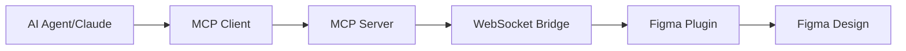

# Figma MCP Write Server

A Model Context Protocol (MCP) server that provides **write access** to Figma through the Plugin API, enabling AI agents to create, modify, and manage Figma designs programmatically.

## 🚀 Overview

Unlike existing Figma MCP servers that use the REST API (which is read-only), this project uses Figma's Plugin API to enable full write operations. This breakthrough allows AI agents to:

- ✅ **Create** design elements (rectangles, ellipses, text, frames)
- ✅ **Modify** existing nodes (properties, position, styling)
- ✅ **Delete** and duplicate design elements
- ✅ **Manage** selections and page content
- ✅ **Export** designs programmatically

## 🏗️ Architecture

The system consists of two main components:

### 1. MCP Server (`src/`)
- **WebSocket Bridge** (`plugin-bridge.ts`) - Manages communication with Figma plugin
- **MCP Server** (`mcp-server.ts`) - Implements Model Context Protocol interface
- **Type Definitions** (`types.ts`) - Shared types and schemas
- **Main Entry** (`index.ts`) - CLI interface and server startup

### 2. Figma Plugin (`figma-plugin/`)
- **Plugin Code** (`code.js`) - Runs inside Figma, executes write operations
- **User Interface** (`ui.html`) - Shows connection status and controls
- **Manifest** (`manifest.json`) - Plugin configuration

## 🔄 How It Works



1. **AI Agent** calls MCP tools (e.g., `create_rectangle`)
2. **MCP Server** receives the request and validates parameters
3. **WebSocket Bridge** sends message to Figma plugin
4. **Figma Plugin** executes the operation using Plugin API
5. **Results** are sent back through the chain to the AI agent

## 📋 Available MCP Tools

| Tool | Description | Parameters |
|------|-------------|------------|
| `create_rectangle` | Create rectangle shapes | x, y, width, height, fillColor, strokeColor |
| `create_ellipse` | Create ellipse/circle shapes | x, y, width, height, fillColor, strokeColor |
| `create_text` | Create text elements | x, y, content, fontSize, fontFamily, textColor |
| `create_frame` | Create frame containers | x, y, width, height, backgroundColor |
| `update_node` | Update node properties | nodeId, properties |
| `move_node` | Move nodes to new positions | nodeId, x, y |
| `delete_node` | Delete nodes | nodeId |
| `duplicate_node` | Duplicate nodes | nodeId, offsetX, offsetY |
| `get_selection` | Get currently selected nodes | - |
| `set_selection` | Set node selection | nodeIds |
| `get_page_nodes` | List all nodes on current page | - |
| `export_node` | Export nodes as images | nodeId, format, scale |
| `get_plugin_status` | Check plugin connection | - |

## 🛠️ Installation & Setup

### Prerequisites
- Node.js 18+
- Figma desktop app or browser access
- MCP-compatible client (Claude Desktop, Cursor, etc.)

### 1. Install Dependencies
```bash
cd figma-mcp-write-server
npm install
```

### 2. Build the Project
```bash
npm run build
```

### 3. Start the Complete System

**Option A: Manual Start (Recommended for Development)**
```bash
# Terminal 1: Start WebSocket Bridge
npx tsx src/index-websocket.ts

# Terminal 2: Start MCP Server v2
node dist/index-v2.js
```

**Option B: Automated Start**
```bash
# This starts both bridge and MCP server
./start-complete-server.sh
```

### 4. Install Figma Plugin
1. Open Figma
2. Go to **Plugins** → **Development** → **Import plugin from manifest**
3. Select `figma-plugin/manifest.json`
4. Run the plugin to establish connection

### 5. Configure MCP Client

For **Claude Desktop**, add to `~/.claude/claude_desktop_config.json`:
```json
{
  "mcpServers": {
    "figma-write": {
      "command": "node",
      "args": ["/path/to/figma-mcp-write-server/dist/index.js"],
      "env": {}
    }
  }
}
```

For **Cursor**, add to MCP configuration:
```json
{
  "mcpServers": {
    "figma-write": {
      "command": "node",
      "args": ["/path/to/figma-mcp-write-server/dist/index.js"]
    }
  }
}
```

## 🎯 Usage Examples

### Create a Simple Layout
```
Create a header frame at the top of the page, then add a title and subtitle inside it.
```

The AI agent will:
1. Use `create_frame` to create the header container
2. Use `create_text` twice for title and subtitle
3. Position elements appropriately

### Design System Operations
```
Create 5 button variants with different colors and update their corner radius to 8px.
```

The AI agent will:
1. Use `create_rectangle` multiple times for button bases
2. Use `create_text` for button labels
3. Use `update_node` to set corner radius and colors

### Batch Operations
```
Select all text elements and change their font size to 16px.
```

The AI agent will:
1. Use `get_page_nodes` to find all text nodes
2. Use `set_selection` to select them
3. Use `update_node` to modify font size

## 🔧 Configuration

### Command Line Options
- `--port <number>` - Server port (default: 3001)
- `--cors-origin <string>` - CORS origin (default: *)
- `--plugin-id <string>` - Plugin authentication ID
- `--max-message-size <number>` - Max WebSocket message size
- `--heartbeat-interval <number>` - Connection heartbeat interval

### Environment Variables
- `FIGMA_MCP_PORT` - Server port
- `FIGMA_MCP_CORS_ORIGIN` - CORS configuration

## 🚦 Connection Status

The system provides real-time connection monitoring:

- **MCP Server**: Logs all client connections and tool calls
- **Figma Plugin UI**: Shows WebSocket connection status
- **Status Tool**: Use `get_plugin_status` to check connectivity

## 🔍 Troubleshooting

### Plugin Won't Connect
1. Check WebSocket port (default: 3002)
2. Verify Figma plugin is running
3. Check browser console for errors
4. Try reconnecting via plugin UI

### Write Operations Fail
1. Ensure plugin is connected (`get_plugin_status`)
2. Check node IDs are valid
3. Verify Figma file is not in Dev Mode
4. Check plugin permissions

### Performance Issues
1. Reduce heartbeat interval
2. Limit concurrent operations
3. Use batch operations when possible
4. Monitor WebSocket message size

## 🆚 Comparison with REST API MCP Servers

| Feature | REST API MCP | Plugin API MCP (This Project) |
|---------|--------------|-------------------------------|
| **Read Operations** | ✅ Full access | ✅ Full access |
| **Write Operations** | ❌ Not supported | ✅ Full support |
| **Real-time Updates** | ❌ Polling only | ✅ Live connection |
| **Authentication** | API Token | Plugin permissions |
| **Setup Complexity** | Simple | Moderate (requires plugin) |
| **Rate Limits** | Yes (REST API limits) | No (direct plugin access) |
| **Offline Usage** | ✅ Works offline | ❌ Requires active Figma session |

## 🛡️ Security Considerations

- WebSocket connections are local-only by default
- Plugin runs in Figma's sandbox environment
- No sensitive data stored in plugin code
- Message validation using Zod schemas
- Connection authentication via plugin ID

## 🚧 Limitations

- Requires active Figma session (desktop/browser)
- Plugin must be manually installed and run
- WebSocket connection can be unstable on poor networks
- Some advanced Figma features may not be supported
- Limited to single file operations (current page)

## 🔮 Future Enhancements

- [ ] Support for multiple Figma files
- [ ] Advanced design system operations
- [ ] Component and variant management
- [ ] Auto-reconnection improvements
- [ ] Batch operation optimization
- [ ] Plugin marketplace publication
- [ ] Integration with design tokens
- [ ] Version history operations

## 📄 License

MIT License - see LICENSE file for details.

## 🤝 Contributing

Contributions welcome! Please see CONTRIBUTING.md for guidelines.

---

**Note**: This project demonstrates a novel approach to Figma automation by bridging MCP with Figma's Plugin API. It's the first MCP server to provide full write access to Figma designs, opening new possibilities for AI-driven design workflows.
