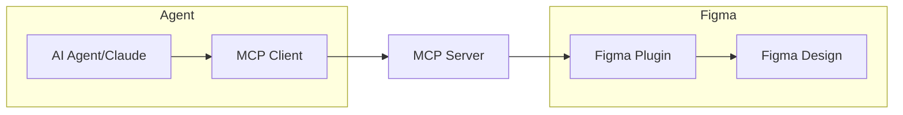
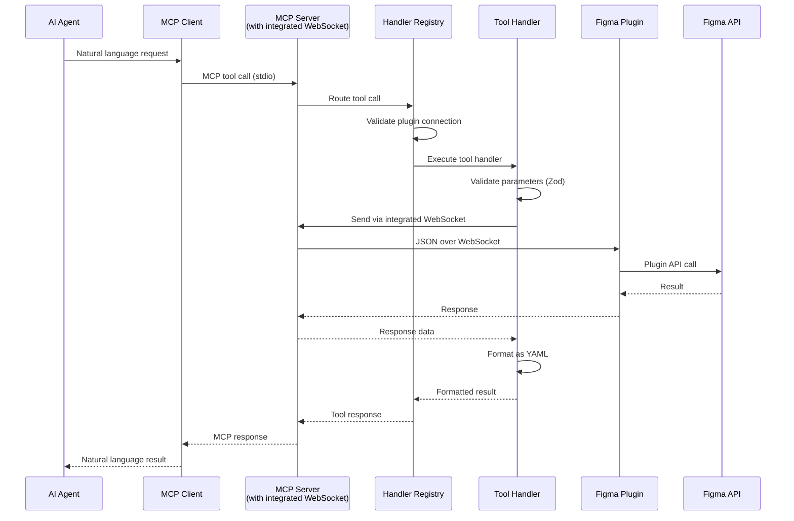

# Development Guide

## Table of Contents

1. [🚀 Quick Start for Contributors](#-quick-start-for-contributors)
2. [🏗️ Architecture Overview](#-architecture-overview)
3. [📋 Handler System](#-handler-system)
4. [🔄 Communication Protocol](#-communication-protocol)
5. [🛠️ Adding a New Tool](#-adding-a-new-tool-step-by-step-example)
6. [⚙️ Configuration](#-configuration)
7. [🧪 Testing Strategy](#-testing-strategy)
8. [🆘 Getting Help](#-getting-help)

---

## 🚀 Quick Start for Contributors

### First Time Setup (5 minutes)
```bash
# 1. Clone and setup
git clone git@github.com:oO/figma-mcp-write-server.git
cd figma-mcp-write-server
npm install
npm run build

# 2. Start development server
npm run dev
```

**3. Install the Figma plugin:**
- Open Figma Desktop
- Go to **Plugins** → **Development** → **Import plugin from manifest**
- Select `figma-plugin/manifest.json` from the project directory
- Run the plugin from **Plugins** → **Development** → **Figma MCP Write Server**

### Verify Everything Works
```bash
# Run tests to ensure everything is working
npm test

# Check WebSocket connection
npm run test:connectivity

# View manual testing guide
npm run test:manual
```

### Your First Contribution

#### Pick a Task
1. **Browse Issues**: Look for "good first issue" labels
2. **Check Documentation**: Areas that need improvement
3. **Test Coverage**: Functions that need more tests
4. **Bug Reports**: Issues that need fixing

#### Make the Change
1. **Create Branch**: `git checkout -b feature/your-change`
2. **Make Changes**: Follow the patterns in existing code
3. **Add Tests**: Ensure your changes are tested
4. **Run Tests**: `npm test` to verify everything works
5. **Submit PR**: Include description of changes

#### Adding Your First Tool
1. **Define Schema** using shared type components from `src/types/`
   - Use `figma-enums.ts` for case-insensitive Figma-specific enums
   - Use `common-fields.ts` for reusable field patterns
   - Use `operation-factory.ts` for standardized operation schemas
2. **Add MCP Handler Method** to appropriate handler class in `src/handlers/`
3. **Add Plugin Implementation** in `figma-plugin/src/operations/`
4. **Register Tool** in handler's `getTools()` method
5. **Test** with `npm test`

**Important**: Ensure both MCP server and Figma plugin handlers implement the same operations to avoid schema/implementation mismatches.

### Quick Test
```bash
npm test              # Run all tests (unit + integration)
npm run test:unit     # Run unit tests only  
npm run test:integration  # Run integration tests only
npm run test:coverage # Generate coverage report
```

## 🏗️ Architecture Overview

The Figma MCP Write Server implements a three-layer architecture connecting AI agents to Figma through the Plugin API:



AI Agent → MCP Protocol → Our Server → WebSocket → Figma Plugin → Figma API

The server translates MCP tool calls into Figma operations and returns structured YAML data.

### Core Design Principles

1. **Logical Tool Consolidation**: Group related operations into single tools with common parameters
2. **ID-Based Operations**: Use explicit node IDs, never selection state dependencies
3. **YAML Response Format**: All tools return structured YAML data within MCP's text field
4. **MCP Protocol Compliance**: Strict adherence to Model Context Protocol standards
5. **Extensible Design**: Easy to add operations without creating tools

### Cross-Platform Build System

The build system is designed for Windows, macOS, and Linux compatibility:

- **Dynamic Path Resolution**: Uses `getDefaultPaths()` from `src/config/config.ts` for platform-specific configuration directories
- **ES Module Consistency**: All build scripts use consistent ES module imports with `createRequire()` for CommonJS dependencies
- **Automatic Cleanup**: Build process removes temporary files (`dist/bundled.js`) to prevent Windows from retaining intermediate bundles
- **Platform Detection**: Automatically handles config paths for Windows (`%APPDATA%`), macOS (`~/Library/Application Support`), and Linux (`~/.config`)

**Build Commands:**
```bash
npm run build              # Full build with cross-platform cleanup
npm run build:plugin       # Plugin-only build with temporary file cleanup
npm run build:plugin-ui    # UI template processing with platform-aware config loading
```

## 📋 Handler System

### Handler Registry (`src/handlers/index.ts`)
Central registry with auto-discovery pattern:

- **Auto-Discovery**: Handlers automatically register via `getTools()` interface method
- **Map-Based Routing**: Efficient Map-based request routing for tool execution
- **Connection Monitoring**: Built-in `get_plugin_status` and `get_connection_health` tools
- **YAML Response Format**: Consistent YAML output for structured data within MCP text format
- **Error Handling**: Error reporting with timestamps and operation context
- **Type Safety**: Full TypeScript integration with runtime validation using Zod schemas

### Available MCP Tools Summary

The server provides 22 consolidated tools organized by domain:

**Core Design Tools**
- `figma_nodes`, `figma_text`, `figma_fills`, `figma_strokes`, `figma_effects`

**Layout & Positioning**
- `figma_auto_layout`, `figma_constraints`, `figma_alignment`, `figma_hierarchy`, `figma_selection`

**Design System**
- `figma_styles`, `figma_components`, `figma_instances`, `figma_variables`, `figma_fonts`

**Advanced Operations**
- `figma_boolean_operations`, `figma_vector_operations`

**Developer Tools**
- `figma_dev_resources`, `figma_annotations`, `figma_measurements`, `figma_exports`

**System Tools**
- `figma_plugin_status`

See README.md for complete tool documentation and parameter details.

## 🔄 Communication Protocol

### MCP Tool Execution Flow



### WebSocket Message Format
```typescript
// Request to plugin (standardized payload wrapper)
{
  id: "uuid-v4",                    // Unique request ID
  type: "CREATE_NODE",              // Operation type
  payload: {                        // Validated parameters
    nodeType: "rectangle",
    width: 100,
    height: 100,
    fillColor: "#FF0000",
    x: 0,
    y: 0
  }
}

// Response from plugin
{
  id: "uuid-v4",
  success: true,
  data: {
    nodeId: "figma-node-id",
    nodeType: "rectangle",
    message: "Rectangle created successfully"
  }
}

// Error response
{
  id: "uuid-v4",
  success: false,
  error: "Node not found: invalid-id"
}
```

## 🛠️ Adding a New Tool: Step-by-Step Example

Let's add a "rotate_node" operation to `manage_nodes`:

### Step 1: Define Schema (types.ts)
```typescript
export const RotateNodeSchema = z.object({
  operation: z.literal("rotate"),
  nodeId: z.string(),
  rotation: z.number() // degrees
});

// Add to existing ManageNodesSchema union
export const ManageNodesSchema = z.discriminatedUnion("operation", [
  MoveNodeSchema,
  DuplicateNodeSchema,
  DeleteNodeSchema,
  RotateNodeSchema // Add this
]);
```

### Step 2: Add Handler Method (handlers/node-handler.ts)
```typescript
private async rotateNode(params: RotateNodeParams): Promise<ToolResult> {
  const response = await this.sendToPlugin({
    type: 'ROTATE_NODE',
    payload: {
      nodeId: params.nodeId,
      rotation: params.rotation
    }
  });

  if (!response.success) {
    throw new Error(response.error || 'Rotation failed');
  }

  return {
    content: [{
      type: 'text',
      text: yaml.dump({
        operation: 'rotate',
        nodeId: params.nodeId,
        rotation: params.rotation,
        message: `Node rotated ${params.rotation} degrees`
      }, { indent: 2, lineWidth: 100 })
    }],
    isError: false
  };
}

// Update manageNodes method to handle operation
async manageNodes(params: any): Promise<ToolResult> {
  const validation = validateAndParse(ManageNodesSchema, params, 'manageNodes');
  
  if (!validation.success) {
    throw new Error(`Validation failed: ${validation.error}`);
  }
  
  const validated = validation.data;

  switch (validated.operation) {
    case 'move': return this.moveNode(validated);
    case 'duplicate': return this.duplicateNode(validated);
    case 'delete': return this.deleteNode(validated);
    case 'rotate': return this.rotateNode(validated); // Add this
    default:
      throw new Error(`Unknown operation: ${validated.operation}`);
  }
}
```

### Step 3: Add Plugin Handler (figma-plugin/src/operations/manage-nodes.ts)
```typescript
export async function rotateNode(payload: any): Promise<any> {
  try {
    const node = figma.getNodeById(payload.nodeId);
    if (!node) {
      return {
        success: false,
        error: `Node ${payload.nodeId} not found`
      };
    }

    // Convert degrees to radians for Figma API
    node.rotation = payload.rotation * (Math.PI / 180);

    return {
      success: true,
      data: {
        nodeId: payload.nodeId,
        rotation: payload.rotation,
        message: `Node rotated ${payload.rotation} degrees`
      }
    };
  } catch (error) {
    return {
      success: false,
      error: `Rotation failed: ${error.message}`
    };
  }
}
```

### Build and Test
```bash
npm run build                # Build everything
npm test                     # Run all tests
npm run test:unit           # Run unit tests only
# Test manually: manage_nodes(operation: "rotate", nodeId: "123:456", rotation: 45)
```

## 🔍 Logging System

Both server and plugin use unified console-style logging interfaces:

### Server Logger
```typescript
import { logger } from '../utils/logger.js';

logger.log('Plugin connected', { connectionId: 'abc123' });    // ✅ 
logger.info('Same as log');                                   // ✅
logger.warn('Font loading failed', { fontName: 'Inter' });    // ⚠️
logger.error('Database connection failed', error);            // ❌
logger.debug('Internal state', { nodeCount: 150 });          // 🐛
```

### Plugin Logger  
```typescript
import { logger } from '../logger.js';

logger.log('Node created successfully');     // ✅ (also to console)
logger.warn('Invalid node type');            // ⚠️ (also to console) 
logger.error('Operation failed', error);     // ❌ (also to console)
logger.debug('Processing step complete');    // 🐛 (also to console)
```

### Log Location
Server logs write to platform-specific cache directories:
- **macOS**: `~/Library/Caches/figma-mcp-write-server/server.log`
- **Windows**: `%LOCALAPPDATA%/figma-mcp-write-server/server.log`  
- **Linux**: `~/.cache/figma-mcp-write-server/server.log`

Plugin logs appear in browser console (F12 → Console tab).

## ⚙️ Configuration

The server creates a configuration file on first run with these key settings:

```yaml
# WebSocket server settings
port: 8765
host: localhost

# Font database configuration
fontDatabase:
  enabled: true
  maxAgeHours: 24
  syncOnStartup: true
  backgroundSync: true

# Logging configuration
logging:
  level: info
  enableFileLogging: false
```

Edit the config file to customize server behavior. Restart the server after changes.

### Configuration Development
The server uses a cross-platform configuration system:
- Config files auto-generate on first run
- Database paths are platform-specific by default
- Font synchronization configurable via YAML

## 🧪 Testing Strategy

### Test Suite (119 Tests)

**Unit Tests (103 tests)**:
- Handler functionality for all tool types
- Parameter validation with Zod schemas
- Error handling and exception patterns
- WebSocket communication logic
- Tool registration and routing

**Integration Tests (16 tests)**:
- MCP server and handler registry integration
- Multi-tool workflows and sequential operations
- Plugin status and health monitoring
- End-to-end tool execution flows

### Test Commands
```bash
npm test                    # Run all tests (119 total)
npm run test:unit          # Unit tests only (103 tests)
npm run test:integration   # Integration tests only (16 tests)
npm run test:coverage      # Generate coverage report
npm run test:watch         # Watch mode for development
npm run test:connectivity  # WebSocket connection test
npm run test:manual        # Display manual test guide
```

### Manual Testing Workflow
1. **Setup**: Start server and load plugin
2. **Basic Operations**: Test core functionality
3. **Features**: Test auto layout, styles, hierarchy
4. **Error Handling**: Test invalid inputs and edge cases
5. **Performance**: Test with large files and many operations

## 🆘 Getting Help

### Common Issues
- **Build Errors**: Check Node.js version (18+) and run `npm install`
- **Plugin Not Loading**: Verify manifest.json path and Figma Desktop version
- **WebSocket Connection**: Ensure server is running on correct port
- **Test Failures**: Check that Figma plugin is not running during tests

### Support Channels
- **GitHub Issues**: For bugs and feature requests
- **Pull Request Reviews**: For code feedback and questions
- **Documentation**: Check README.md and examples.md for usage help

### Next Steps
- **Read Examples**: Check [examples.md](examples.md) for usage patterns
- **Explore Codebase**: Browse `src/handlers/` to understand tool implementations
- **Run Tests**: Use `npm test` to understand expected behavior
- **Contribute**: Pick an issue and submit your first PR!

## 📚 Additional Documentation

For detailed implementation guides, architecture specifics, and advanced topics, see:
- **[architecture.md](architecture.md)** - Deep technical implementation details
- **[patterns.md](patterns.md)** - Handler patterns and best practices
- **[contributing.md](contributing.md)** - Step-by-step development guides  
- **[testing.md](testing.md)** - Testing strategies and procedures