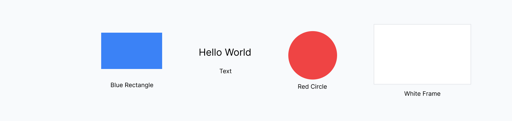
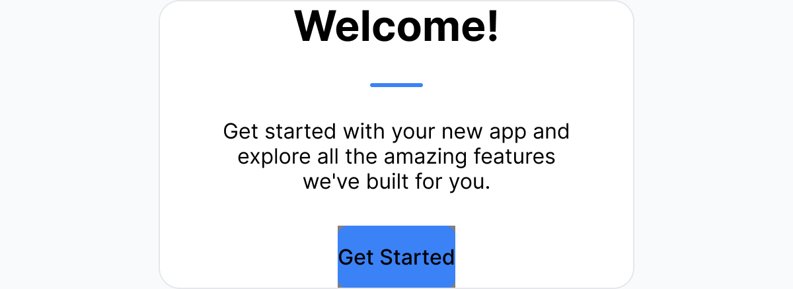

# Getting Started with Figma MCP Write Server

> **Use Cases**: Learn basic design operations - creating shapes, text, and simple layouts. Perfect for first-time users or testing the connection.

## Quick Examples



- "Create a blue rectangle" → Blue rectangular shape on canvas
- "Add hello world text" → Text element with default styling  
- "Make a red circle at position 100, 50" → Red circle at specific coordinates
- "Create a white frame container" → Frame element for layouts

## Core Operations

### Creating Basic Shapes

#### Rectangle Creation
**When to use**: Building UI components, backgrounds, containers, or geometric designs

**User instruction**: "Create a blue rectangle 200 pixels wide by 100 pixels tall"

**What happens**:
1. AI uses `create_node` tool with rectangle type
2. Sets width: 200, height: 100 properties
3. Applies blue fill color
4. Places on canvas with default positioning

```yaml
# Example response
operation: create_node
result:
  nodeId: "123:456"
  nodeName: "Rectangle"
  nodeType: "RECTANGLE"
  width: 200
  height: 100
  fillColor: "#0066FF"
```

#### Circle and Ellipse Creation
**When to use**: Icons, avatars, decorative elements, or organic shapes

**User instruction**: "Make a profile picture placeholder - gray circle 80px diameter"

**What happens**:
1. AI uses `create_node` tool with ellipse type
2. Sets equal width/height for perfect circle
3. Applies gray fill color
4. Names appropriately for context

### Text Creation

#### Basic Text Elements
**When to use**: Headings, labels, body content, or any text-based interface elements

**User instruction**: "Add a title that says 'Welcome to My App' in large text"

**What happens**:
1. AI uses `create_text` tool with characters parameter
2. Sets appropriate font size for title context
3. Applies default font family and styling
4. Positions text element on canvas

#### Text with Custom Styling
**When to use**: Brand-specific typography, emphasis, or styled content

**User instruction**: "Create a heading with the word 'NEW' in red and bold"

**What happens**:
1. AI uses `create_text` tool with mixed styling
2. Applies styleRanges for specific text segments
3. Sets font weight and color for "NEW" portion
4. Uses appropriate font size for heading context

### Frame Containers

#### Basic Containers
**When to use**: Grouping elements, creating layouts, or organizing content sections

**User instruction**: "Create a card container 300x200 pixels with white background"

**What happens**:
1. AI uses `create_node` tool with frame type
2. Sets container dimensions
3. Applies white background fill
4. Creates structure ready for content

## Quick Start Workflow

### Your First Design
**User instruction**: "Create a simple welcome card with title, description, and button"

**What the AI does**:
1. **Container**: Creates white frame container (320x240px)
2. **Title**: Adds "Welcome!" text with large font size
3. **Description**: Creates body text "Get started with your new app"
4. **Button**: Makes blue rectangle with white "Get Started" text
5. **Layout**: Positions elements with proper spacing



### Testing Your Connection
**User instruction**: "Check if everything is working by creating a blue square"

**What the AI does**:
1. **Status Check**: Uses `get_plugin_status` to verify connection
2. **Simple Create**: Uses `create_node` to make basic shape
3. **Confirmation**: Returns success status and node details
4. **Visual Feedback**: Shape appears immediately in Figma

## Tips for Beginners

### Connection Setup
- Make sure Figma plugin is running and connected
- Use `get_plugin_status` to verify connection health
- Plugin shows green status when properly connected
- WebSocket connection automatically reconnects if dropped

### Effective Instructions
- **Be Specific**: "Create a 200x100 blue rectangle" vs "make a shape"
- **Use Natural Language**: "Add a title" vs technical parameter names
- **Start Simple**: Test basic shapes before complex layouts
- **Name Things**: Ask for "primary button" not just "rectangle"

### Common First Steps
1. **Test Connection**: "Check plugin status"
2. **Create Basic Shape**: "Make a blue rectangle"
3. **Add Text**: "Add hello world text"
4. **Try Colors**: "Create a red circle"
5. **Make Container**: "Create a white frame"

### Error Handling
- **Connection Issues**: Plugin shows red status - restart plugin
- **Invalid Instructions**: AI provides clear error messages with suggestions
- **Missing Parameters**: Tool validation guides you to required information
- **Tool Failures**: Detailed YAML responses explain what went wrong

## Next Steps

Once you're comfortable with basic operations:

- **[Layout System →](layout-system.md)**: Learn auto layout and responsive design
- **[Design System →](design-system.md)**: Create consistent styles and components  
- **[Advanced Operations →](advanced-operations.md)**: Boolean operations and complex workflows

## Troubleshooting

### Plugin Won't Connect
1. Check that Figma Desktop is open
2. Verify plugin is installed and running
3. Check WebSocket port (default: 8765)
4. Look for connection status in plugin UI

### Commands Not Working
1. Use `get_plugin_status` to check connection
2. Verify you're in design mode (not dev mode)
3. Make sure you have edit permissions on the file
4. Try simpler commands first to isolate issues

### Getting Help
- **Plugin Status**: Use `get_plugin_status` for connection info
- **Clear Instructions**: Be specific about what you want to create
- **Error Messages**: Read AI responses for troubleshooting guidance
- **Start Over**: Create new shapes to test if commands are working

---

**Remember**: Give natural language instructions and let the AI handle the technical details. You don't need to know tool names or parameters!